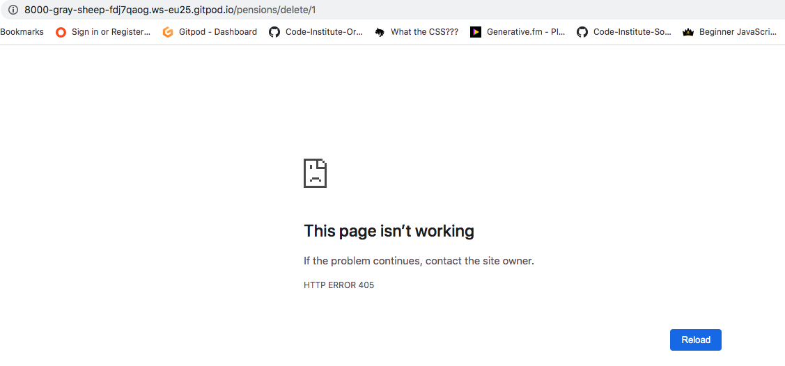

# PensionPal
---
*Note: this website was created for educational purposes as a student of Code Institute, and the website described below is a fictional one.*

PensionPal is a website for users in Ireland to record details of their working life and private pensions so that the information is in one location and easy to access when it comes to retirement. Tracking the information along the way, e.g. on leaving employment, is much easier than trying to find it years later at retirement age.

[View the live website here](https://pensionpal.herokuapp.com/). *Link opens in same tab, right click to open in a new tab.*


## Table of Contents
---
- [Purpose](#purpose)
- [User Experience (UX)](#user-experience-ux)
  * [User stories](#user-stories)
  * [Design](#design)
  * [Wireframes](#wireframes)
- [Features](#features)
  * [Existing Features](#existing-features)
  * [Future Features](#future-features)
- [Content Requirements](#content-requirements)
- [Database Schema](#database-schema)
- [Project Structure](#project-structure)
- [Technology](#technology)
  * [Languages](#languages)
  * [Frameworks, Libraries, Programmes and Tools](#frameworks-libraries-programmes-and-tools)
- [Testing](#testing)
  * [Code Validation](#code-validation)
  * [Test Cases - user stories](#test-cases---user-stories)
  * [Features Testing](#features-testing)
  * [Other Manual Testing](#other-manual-testing)
  * [Automated Testing](#automated-testing)
  * [Fixed Bugs](#fixed-bugs)
  * [Supported Screens and Browsers](#supported-screens-and-browsers)
- [Deployment](#deployment)
  * [Gitpod - during development](#gitpod---during-development)
  * [Deployment to Heroku](#deployment-to-heroku)
  * [Forking the GitHub Repository](#forking-the-github-repository)
  * [Cloning the GitHub Repository](#cloning-the-github-repository)
- [Credits](#credits)
  * [Code](#code)
  * [Content](#content)
  * [Media](#media)
- [Acknowledgements](#acknowledgements)

## Purpose
---
The purpose of PensionPal is to allow users to record the details of their working life and private pensions in one single location. The aim is for users to record these details at the time, e.g. when finishing up in a job, while the information is to hand and fresh in their minds, rather than having to find this information years later at retirement age. When they get to retirement age, then all the information is easily accessible, making the process of drawing down the retirement benefits much simpler.

The initial iteration of PensionPal allows users to record employments, and record "defined contribution" pension schemes related to these employments. It can be extended in the future to allow more complex records: "defined benefit" occupational pension schemes, self-employed details, and can be extended further as outlined in the [Future Features section](#future-features).

The target audience are employees of any age, working in Ireland (pension features differ in different countries, and the information to be recorded is specifically based on Irish pensions). Employees who are not part of a pension scheme are still part of the target market, because they can still record their employment details (which can be used at a later date to determine eligibility for the State Pension Contributory), and it may also help them to learn some information about pensions so that they might set one up.

Of particular interest within the target market are women, who traditionally participate less in the pension system; and younger people, who are traditionally not as aware of pensions as older workers. 

### User’s goals:
- Users want to be able to record details of their employments, and the pension (if any) attached to their employment
- Users want to be able to add more records over time, as they start and finish different jobs, with different pensions attached
- Users want to be able to view the records they have added over time, edit a record if any information was incorrect or needs to be updated, or delete the record completely if they added it in error

### Site owner’s goals:
- Provide a place for registered users to easily record the details of their employments, and attached pensions 

## User Experience (UX)
---
### User stories
- As a visiting user, I can learn what the site is about, so I can decide whether to sign up to the site
- As a site user, I can navigate the site so that I can find the page I want to go to 
- As a registered user, I can sign into my account so that I can access my jobs and pension information
- As a registered user, I can sign out of my account when finished, so that I know I am signed out securely
- As a registered user, I can re-set my password so that I can gain access to my account if I forgot my password
- As a new user, I can sign up for an account so that I can start recording my jobs and pensions details
- As a registered user, I can record details of a job so that I can build up my employment history records
- As a registered user, I can see all the jobs I have added so that I can get the overall picture of my work history
- As a registered user, I can edit a job so that I can correct the previously recorded information
- As a registered user, I can delete a job so that I can remove it from my records if I added it in error 
- As a registered user, I can record the details of a pension so that I can have the pension recorded on my account
- As a registered user, I can view the pensions I have added so that I can see all my pension details in one place
- As a registered user, I can edit a pension I previously added, so that I can correct or update the previously recorded information
- As a registered user, I can delete a pension I previously added, so that I can remove it from my records if I added it in error 
- As a site user, I can access external resources relating to pensions, so that I can find out more information 
- As a site user, I can find the PensionPal social media accounts, so that I can follow them on social media to keep up to date
- As the website owner, I can maintain a list of pension providers and their websites, so that users can select the pension provider when adding or editing a pension in My Pensions page

### Design
The design deliberately steers clear from the usual look for financial product websites, which typically tend towards using blue or red. Since PensionPal is a new concept that doesn't exist in the Irish market, the branding reflects this and uses colours not normally associated with financial matters or pensions. 

This design decision serves three functions: 
1) to stand out in the market from other financial products, 
2) to appeal to the younger section of the target market, 
3) to reinforce the perception of the ease of use of PensionPal, away from the traditional concept of pensions being difficult and confusing!

- #### Colour scheme
The website uses shades of deep purple/blue, with accents of a vivid fuschia pink as a contrasting pop of colour.

Colour palette:


- Midnight blue `#131967` is used for the header and is the main text colour 
- Fuschia `#ff00ff` is the brand colour and is used for the logo and menu items in the header. It is also used as an accent colour througout the site for button backgrounds, link underlines, footer headings, etc.
- Oxford Blue `020638`, a complementary darker shade of Midnight blue, is used for the footer background
- Baby Powder `faf9f6` is an off-white used for text that appears on darker backgrounds
- Space Cadet `#322c53` is used for the overlay on the hero-image, to provide a darker background and sufficient contrast for the hero text
- Orchid Pink `#facdd7` is used for the full width background for the home page banner under the hero text

The colour combinations have all been checked for accessibility using the [WCAG Contrast Checker tool](https://chrome.google.com/webstore/detail/wcag-color-contrast-check/plnahcmalebffmaghcpcmpaciebdhgdf?hl=en) to meet at least level AA. 

- #### Typography
Montserrat is used throughout the entire website, with the different weights used to distinguish the headings, body text, etc. This is a clean, sans serif typeface which fits well with the style for this project. It is relatively rounded and is very readable, making it an appropriate choice for the body text. The heavier weights work well for the headings, since the design of this typeface was inspired by old signage and posters. 

### Wireframes
#### Desktop/Tablet
- [Home page](docs/wireframes/home-desktop.png)
- [My Jobs](docs/wireframes/my-jobs-desktop.png)
- [Edit, Delete a Job](docs/wireframes/edit-delete-job-desktop.png)
- [My Pensions](docs/wireframes/my-pensions-desktop.png)
- [View, Edit, Delete a Pension](docs/wireframes/view-edit-delete-pension-desktop.png)
- [Sign Up](docs/wireframes/sign-up-desktop.png)
- [Sign In](docs/wireframes/sign-in-desktop.png)

#### Mobile
- [Home page](docs/wireframes/home-mobile.png)
- [My Jobs](docs/wireframes/my-jobs-mobile.png)
- [Edit, Delete a Job](docs/wireframes/edit-delete-job-mobile.png)
- [My Pensions](docs/wireframes/my-pensions-mobile.png)
- [View, Edit, Delete a Pension](docs/wireframes/view-edit-delete-pension-mobile.png)
- [Sign Up](docs/wireframes/sign-up-mobile.png)
- [Sign In](docs/wireframes/sign-in-mobile.png)

[View all wireframes in pdf here.](docs/wireframes/wireframes-all.pdf)

## Features
---
### Existing Features
- #### Header
  * Top of every page, contains website name on the left, Sign Up and Sign In links on the right.
  * When a user is logged in, the header changes as follows:
    * user name is shown
    * navigation links change to My Jobs, My Pensions, Sign Out
  * Website name links back to the home page
  * Fixed to the top of the page so that navigation links are always available to the user
  * Navigation links collapse to hamburger on smaller screens
- #### Footer
  * Bottom of every page, not fixed (so as not to take up too much screen space on smaller screens) but sticks to bottom of screen even if not enough content to push it down
  * Contains Useful links and Social Links
  * Userful links: link to The Pensions Authority, Revenue and Citizens Information websites
  * Social links: Instagram, Facebook and Twitter pages for PensionPal
  * All these links are external and open in a new window
- #### Home page
  * Three sections: Landing, Summary and Details
  * Landing section
    * Hero image, tagline and three buttons for the most important actions: Learn More (for users who are new to the site), Sign Up, Sign In for existing users
  * Summary section
    * 3 cards giving a high level summary of what the website can achieve for the user. Each one is an icon along with a short sentence.
  * Details section
    * the Learn More link in the Landing section brings the user here
    * This section is designed to give a new user all the information they need to 1)learn the purpose of the website, 2)why they should use it (the benefits to them) and 3)how they can use it.
    * This information is outlined in the three headings
      * What is PensionPal
      * Why Use PensionPal
      * How to Use PensionPal
- #### Sign Up page
  * Sign up form for new user with the following fields, all mandatory
    * Username
    * Email address
    * Password
    * Confirm Password
  * Sign up button to submit the form
  * Redirects to the Sign In page once the form is submitted
  * Note at the top of the form directing people who have already registered to the sign in page
- #### Sign In page
  * Sign in form for existing user with the following fields, all mandatory
      * Username
      * Password
  * Sign In button to submit the form
  * Redirects to the My Jobs page once the form is submitted
  * Forgot password section with email address field and Send button
  * Note at the top of the form directing people who have not yet registered as a user to the sign up page
- #### My Jobs page
  * Two sections: Add Job and Your Jobs
  * Add Job
    * Button called Add Job which directs user to a new page
    * Text underneath explaining to add the job/employment first, then if there is a pension attached to the job, to add this in the My Pensions page
    * Add Job page contains a form with the following mandatory fields: Company name, Date of joining, Date of leaving, Full-time or part-time
    * Add Job button to submit the form
    * Redirect to a success page confirming the employment/job has been added, reminding the user to add the pension details now, and advising where to view/edit/delete the job details 
  * Your Jobs
    * a series of cards displaying the details of all the jobs/employments the user has added to date
    * if there are none, then a note confirming this
    * each card contains
      * card header: Company name
      * card body: date of joining and leaving service, full/part-time
      * card footer: Edit and Delete buttons
    * Edit Employment page displays when the Edit button is clicked
      * Form containing the following mandatory fields, pre-populated with the existing information: Company name, Date of joining, Date of leaving, Full-time or part-time
      * Confirm changes button to submit the form, redirects to the My Jobs page
      * Cancel button brings the user back to the My Jobs page
    * Delete Employment modal displays when the Delete button is clicked
      * Warning message to the user, advising that this can't be un-done and will also result in deletion of any Pensions attached to the employment
      * Cancel button brings the user back to the My Jobs page
      * Delete Job button to confirm deletion of the employment and redirects back to the My Jobs page
- #### My Pensions page
  * Two sections: Add Pension and Your Pensions
  * Add Pension
    * Button called Add Pension which directs user to a new page
    * Text underneath reminding to add the job/employment first in case they have not done this. As the pension is attached to the employment.
    * Add Pension page contains a form with the following fields:
      * Choose Employment: dropdown list of employments added by the user, mandatory
      * Pension Scheme name: text, mandatory
      * Policy or scheme number, mandatory
      * Member number, optional
      * Type of pension: dropdown list, mandatory
      * Date joined pension scheme: date, mandatory
      * Salary at date of leaving service: text, mandatory
      * Is there a Pension Adjustment Order on the pension: tick box, defaults to un-ticked
      * Were you a 20% director in this employment: tick box, defaults to un-ticked
      * Pension provider: dropdown list, mandatory
      * Pension value: text, mandatory
      * Upload recent statement: file upload, optional
      * Additonal notes: textarea, optional
      * Add Pension button to submit the form
      * Redirects to a success page confirming the pension has been added, and advising where to view/edit/delete the pension details
  * Your Pensions
    * a series of cards displaying the summary details of all the pensions the user has added to date
    * if there are none, then a note confirming this
    * each card contains
      * card header: Pension type and Company name
      * card body: pension value
      * card footer: View Details, Edit and Delete buttons
    * Pension Details page displays when the View Details button is clicked
      * Displays the following information, which is from the Employment and the Pension tables:
        * Pension type and Company name
        * Pension scheme name
        * Policy/scheme number
        * Member number (if provided)
        * Date joined pension scheme
        * Date of joining service
        * Date of leaving service
        * Salary at date of leaving service
        * Pension Adjustment Order (displays Yes or No)
        * 20% director in this employment (displays Yes or No)
        * Full-time or part-time employment
        * Pension provider
        * Pension provider website
        * Pension value
        * Link to file that was uploaded by user (if provided)
        * Your notes: the notes from Additional Notes section, if provided
      * Edit and Delete buttons underneath the pension details
      * Link at the top of the back to go Back to My Pensions
    * Edit Pension page displays when the Edit button is clicked
      * Form containing the same fields as the Add Pension form, pre-populated with the existing information
      * Confirm changes button to submit the form, redirects to the My Pensions page
      * Cancel button brings the user back to the My Pensions page
    * Delete Pension modal displays when the Delete button is clicked
      * Warning message to the user, advising that this can't be un-done
      * Cancel button brings the user back to the My Pensions page
      * Delete Pension button to confirm deletion of the pension and redirects back to the My Pensions page

### Future Features 
- extend Pension model to allow for defined benefit pension schemes, the user would need to record their benefits (e.g. pension per year, lump sum amount, spouse's pension amount) instead of recording the current value of the scheme
- extend Pension model so more than one employment can be attached to a Pension (to cater for instances where a pension scheme from one emplpoyment is transferred into the new employment pension scheme)
- extend Pension model to include the status of the pension scheme e.g. active, transferred out, benefits taken. If transferred out, link it to the new pension scheme
- allow users to record an Employment that hasn't yet ceased and a Pension attached to the employment, along with current contribution amount. A calculator could be added to show how much extra could be contributed under the tax relief limits
- add functionality to allow users to record gaps in employment, and the reasons for the gaps (this would be helpful for determining eligibility for State Pension(Contributory), SPC at retirement and how much SPC might be paid)
- add functionality for users to record salary records for multiple years for a Pension, as well as overtime/bonuses etc. This would be useful for calculating "final remuneration" especially for "20% directors". Also allow users to upload their P60 for these years as proof of salary that will be needed at retirement stage.
- Create a calculator that would calculate best "final remuneration" from the salary details (this might be quite complex to do)
- Add functionality to record the number of "insurable weeks" in each year of an employment, along with PRSI class. This would be helpful for determining eligibility for SPC at retirement and how much SPC might be paid
- Add functionality so that a user could consent to their financial advisor accessing their records on the website (perhaps for a limited time period), and the financial advisor can login and view the user's records on a read-only basis. This would be useful for the financial advisor to get an overview before a financial review meeting etc.

## Content Requirements
---

### Database Schema
---
The dataset for this project consists of the information entered by each registered user on their employments and attached pensions.

Some of the factors taken into account when creating the data model:
- a user can only view details of the Job and Pension records they entered, they cannot view records of other users, therefore:
  * The user who created the record must be recorded on each Job record and Pension record
  * User will be a Foregin Key (one to many relationship) in the Job model and Pension model
- Each Pension record must have an associated employment/job, and can only be linked to one employment/job in this iteration of the project (later iterations may include functionality to add more than one employment to a pension, see [Future Features](#future-features)). An Employment/Job can be linked to more than one pension
  * Job/Employment is a Foreign Key (one to many relationship) in the Pension model.
- The Pension records will be displayed as a series of cards in the My Pensions page, with summary details on the card. The user can click on View Details to view the complete details. 
  * Therefore a slug will be used to generate the url when viewing the full detail of a pension record
- The user can upload a file as part of a Pension record. Since the live project will be deployed on Heroku which has ephemeral file storage, these files will be hosted on Cloudinary for persistent file storage
  * CloudinaryField will be used in the Pension model to store the url for the hosted file 
- Pension provider name will be recorded as part of each Pension record. 
  * To ensure consistency, and to allow the pension provider website to be pre-populated instead of the user having to enter it on the Add Pension form, the list of pension providers and their associated website url will be contained in a separate PensionProvider table managed by the website owner
  * Pension provider name will be a Foreign Key (one to many relationship) in the Pension model
* All custom models will use the Django default primary key of auto-incrementing id

The data is organised using the following models:

- User
  * using the Django built in User model
  * records are created in this table via the Sign Up form on the frontend
- Job

  * records are created, edited and deleted by a registered user from the frontend
  * created via the Add Job button and form from My Jobs page
  * edited via the Edit Job form accessed using the Edit button
  * deleted via the Delete record modal accessed using the Delete button
  * records are viewed on the My Jobs page
  * some details from the employment record are used when viewing the Pension details on My Pensions page
- Pension

  * records are created, edited and deleted by a registered user from the frontend
  * created via the Add Pension button and form from My Pensions page
  * edited via the Edit Pension form accessed using the Edit button
  * deleted via the Delete record modal accessed using the Delete button
  * records are viewed on the My Pensions page
- PensionProvider

  * records are created, edited and deleted via the Admin panel by the website owner and cannot be edited by a regular user
  * data in this model is viewed as part of the Pension view

## Project structure
---
The project is developed using the Django framework and will be split into three apps within the Django project:
- Pages
  * Will display the Home page (and any other general pages that may be added in the future). 
  * This app does not have a model as it does not require any database information, this is a static page displaying information. 
- Jobs
  * To handle creating, viewing, editing and deleting jobs/employments by a registered user. 
  * This app will use the Job model outlined above to hold the job/employment information created by users
- Pensions
  * To handle creating, viewing, editing and deleting pensions by a registered user. 
  * This app will use the Pension model described above to hold the pension information created by users
  * This app depends on the Jobs app, as it requires information from the Job model for creating/editing of a pension record and for viewing pension details
  * This app will also use the PensionProvider model

## Technology
---
### Languages
### Frameworks, Libraries, Programmes and Tools

## Testing
---
This will most likely be split into its own file once completed.
### Code Validation
### Test Cases - user stories
### Features Testing
### Other Manual Testing
### Automated Testing
### Fixed Bugs
The following bugs were encountered during development and during testing.

- **Issue: Edit Job Form not showing the existing data on the form for start date and finish date**

The error in the Console stated: `the specified value "06/09/2020" does not conform to the required format, "yyy-MM-dd"`
> Solution:
Amended the `widgets` setting in the `AddJobForm` in `forms.py`, for the `DateInput format` from `%d/%m/%Y` to `%Y-%m-%d` so that it matches the format expected, as [explained in this post on Stackoverflow](https://stackoverflow.com/questions/66504151/django-update-form-does-not-conform-to-the-required-format-yyyy-mm-dd). The front end still displays the desired format of dd/mm/yyyy (for Irish users) because the `LANGUAGE_CODE` had been set to `en_gb` in `settings.py`. 
- **Issue: `Add Pension Form` 'employment' field displaying all employments not just those belonging to that user**

When the Add Pension form was displayed to the user, it is displaying all Employments from the Job table, but these need to be filtered to only show the records added to the Job table by that user. 
> Solution: Followed the advice in this [post on Stack Overflow](https://stackoverflow.com/questions/15608784/django-filter-the-queryset-of-modelchoicefield/15608899): Instead of amending the `forms.py`, added the below to the `AddPension` view in `views.py` so that the field contains just the `Job` records added by the current user. 
```python
form.fields['employment'].queryset = Job.objects.filter(added_by=request.user)
```
- **Issue: Testing the `AddPension View`, form would not post due to incorrect data in 'employment' and 'pension_provider' fields**

When testing the POST part of the `AddPension` View, the test was failing because the page was not redirecting as expected. This was because some of the form data was not valid, so the form was not posting and the page only redirects when the form is valid. 
> Solution: The issue was because of invalid data on the 'employment' and 'pension_provider' fields, which are foreign keys in the Pension model (from Job and Provider models respectively). When passing the data to post the test form, I had been passing in the relevant values from the test Job and Provider records, like the below:
```python
'employment': 'Test Company',
'pension_provider': 'A Pension Provider',
```
However, since these are foreign keys I needed to use their id instead of the actual values, as outlined in this [post on Stack Overflow](https://stackoverflow.com/questions/37393788/django-testing-a-form-is-valid-when-it-contains-a-modelchoicefield). Amended the data being passed to post the form to reference the id (which was 1 in both cases), like below, the tests then passed as the page redirected after posting the form:
```python
'employment': str(1),
'pension_provider': str(1),
```

- **Issue: File upload to Cloudinary from `PensionForm` not working**

Adding a file via the optional `file` field on the Add Pension or Edit Pension form did not give any errors and the form could be submitted, but the file did not appear when viewing the pension details on the frontend, nor did it appear in Cloudinary. When viewing the pension record in the Django admin panel, the file did not appear there either.
> Solution: On investigation with [Code Institute's](https://codeinstitute.net/ie/) tutor support, it transpired that the issue did not arise when adding a pension (with file upload) via the Django admin panel. However for this to work via the front end form, two parts were missing, as explained in the [Django docs](https://docs.djangoproject.com/en/4.0/topics/http/file-uploads/):
1. The `post` part of the `view` for posting the form needed to include `request.FILES` in the form constructor (see below), in order to record the file data:
```python
form = PensionForm(request.POST, request.FILES)
```
2. The `form` element in the relevant `html` files needed to include the `enctype` attribute with the value `"multipart/form-data"` as this is required where a file is uploaded through a form 

- **Issue: Using the delete pension or delete job url gives a 405 error instead of the custom 404 page**

Delete Pension url with valid pension id:

Delete Job url with valid job id:

If a user tried to access the delete url (by typing the url into the browser) for a pension or job using a valid job or pension id that belongs to that user, a 405 error is raised instead of 404 (a 404 error would be raised if they used an invalid id in the url, and the custom 404 page would be displayed).
> Solution: The 405 http error [means method not allowed](https://httpstatuses.com/405), so it is being raised because there was no `get method` on the `DeleteJob` or `DeletePension` views (there was only a `post method` to delete the record, triggered by the Delete button in the modal). Updated both views to include a `get method`, which raises a 404 error so that the user will see the custom 404 page. There is no way to access the delete url from the website, but this update was done in case a user types the url into the browser, so that they are shown the custom 404 page instead of the generic 405 error page. 

### Supported Screens and Browsers

## Deployment
---
### Gitpod - during development
Gitpod was used as the development environment, with GitHub for version control and hosting the repository. The repository for this project, and the associated workspace, was created from the [Code Institute student tempate](https://github.com/Code-Institute-Org/gitpod-full-template). 
-   During development, code was written in the Gitpod workspace and changes to the frontend were previewed by opening the browser via the terminal in Gitpod, using the command `python3 manage.py runserver` and then selecting the Open Browser button when the following message appeared: "a service is available on Port 8000".
- Libraries/Frameworks used in the application were installed by typing the relevant install command (as per documentation) in the terminal, e.g. `pip3 install django`, where Django is the name of the framework being installed
-   Files and code were added to the staging area in Gitpod using the command `git add .` and commited using `git commit -m "commit message"`. 
-   Commited changes were then pushed to GitHub using the `git push` command.

### Deployment to Heroku
### Forking the GitHub Repository
The repository can be forked on GitHub, this creates a copy of the repository that can be viewed or amended without affecting the original repository. This can be done using the following steps:
1. Login to [GitHub](https://github.com/) 
2. Locate the relevant repository on GitHub. [This is the repository for PensionPal](https://github.com/Fiona-T/pension-pal).
3. At the top right of the repository (under your avatar) locate the Fork button and click this button
4. You should now have a copy of the repository in your own GitHub account, to which you can make changes
5. To run the project locally, you will need to create an `env.py` file with the environment variables and install the requirements from the `requirements.txt` file using `pip3 install -r requirements.txt`

### Cloning the GitHub Repository
You can make a clone of the repository which will create a local copy on your own computer. Again you can make changes to this local copy that will not affect the original repository. Follow these steps to clone the PensionPal repository. 
1. Login to [GitHub](https://github.com/) and locate the repository as before
2. Click the button called Code, located to the left of the green Gitpod button
3. Under HTTPS copy the link provided (in this case https://github.com/Fiona-T/pension-pal.git) 
4. Go to Gitpod or whichever IDE you are using and open the Terminal
5. Change the current working directory to the location where you want the cloned directory to be made
6. Type `git clone` followed by the url you copied in step 3:
`git clone https://github.com/Fiona-T/pension-pal.git`
7. Press Enter to create the local clone
8. To run the project locally, you will need to create an `env.py` file with the environment variables and install the dependencies from the `requirements.txt` file using `pip3 install -r requirements.txt`

You can refer to the [GitHub documentation](https://docs.github.com/en/github/creating-cloning-and-archiving-repositories/cloning-a-repository) for more detailed information on the above process.

## Credits
---
### Code
- To change the colour of the bootstrap menu icon, I used one of the approaches outlined in [this discussion on Stack Overflow](https://stackoverflow.com/questions/42586729/how-can-i-change-the-bootstrap-4-navbar-button-icon-color), which was to locate the svg `background-image` url and then amend the `rgba` value inside it
- The code for the sticky footer is from [this post on CSS Tricks](https://css-tricks.com/a-clever-sticky-footer-technique/)
- Guidance on how to filter the objects returned from the model by the user (so to display only the Jobs that were added by that user), by over-riding the `get_queryset() method` in the `ListView` generic `View` was found [in the Django docs](https://docs.djangoproject.com/en/3.2/topics/class-based-views/generic-display/)
- Guidance on testing `Views` that require a user to be logged in was found [in this tutorial from Mozilla](https://developer.mozilla.org/en-US/docs/Learn/Server-side/Django/Testing)
- Guidance on how to change the format of the date displayed on the frontend and in the admin panel to dd/mm/yyyy was found in [this discussion on Stack Overflow](https://stackoverflow.com/questions/7216764/in-the-django-admin-site-how-do-i-change-the-display-format-of-time-fields). There are a few methods outlined, then one used in the project was to change the `LANGUAGE_CODE` in `settings.py` to `en-gb`
- For setting the format of the date input to forms on the frontend, and including a datepicker, guidance was found in [this post on Stack Overflow](https://stackoverflow.com/questions/49440853/django-2-0-modelform-datefield-not-displaying-as-a-widget) as well as [this post from Stack Overflow](https://stackoverflow.com/questions/33021652/django-modelform-not-validating-correctly-with-custom-date-format). As described in the [Fixed Bugs](#fixed-bugs) section, with this set up, the Edit Job Form was not displaying the existing dates on the form because of a conflict with the expected date settings, so I amended the `DateInput format` used in the `widgets` setting in the form, as [explained in this post on Stack Overflow](https://stackoverflow.com/questions/66504151/django-update-form-does-not-conform-to-the-required-format-yyyy-mm-dd)
- How to show the id field in the Django admin panel was found [in this Stack Overflow post](https://stackoverflow.com/questions/47138660/show-object-id-primary-key-in-django-admin-object-page)
- Approach to use for pagination is from [the Django docs](https://docs.djangoproject.com/en/3.2/topics/pagination/)
- Guidance on how to create a link to go back to the previous page (for the Cancel button on the Sign Out page) was found on [Stack Overflow](https://stackoverflow.com/questions/8814472/how-to-make-an-html-back-link) and [W3 Schools](https://www.w3schools.com/jsref/obj_history.asp)
- Used the guidance in [the Django docs](https://docs.djangoproject.com/en/4.0/ref/forms/fields/#django.forms.ModelChoiceField) to add a note for the user at the top of the `select` dropdown menus on the `PensionForm` 

### Content
### Media
- The background hero image for the home page was sourced from [Vecteezy](https://www.vecteezy.com/vector-art/1428520-online-training-woman-using-laptop-for-cloud-computing) and edited slightly by the developer. The image is credited in the website footer, in line with Vecteezy attribution requirements.

## Acknowledgements
---