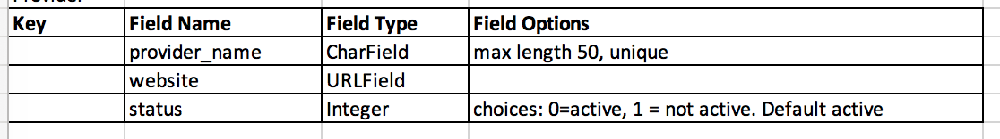

# PensionPal
---
*Note: this website was created for educational purposes as a student of Code Institute, and the website described below is a fictional one.*

PensionPal is a website for users in Ireland to record details of their working life and private pensions so that the information is in one location and easy to access when it comes to retirement. Tracking the information along the way, e.g. on leaving employment, is much easier than trying to find it years later at retirement age.

[View the live website here](https://pensionpal.herokuapp.com/). *Link opens in same tab, right click to open in a new tab.*


## Table of Contents
---
- [Purpose](#purpose)
- [User Experience (UX)](#user-experience-ux)
  * [User stories](#user-stories)
  * [Design](#design)
  * [Wireframes](#wireframes)
- [Features](#features)
  * [Existing Features](#existing-features)
  * [Future Features](#future-features)
- [Content Requirements](#content-requirements)
- [Database Schema](#database-schema)
- [Project Structure](#project-structure)
- [Technology](#technology)
  * [Languages](#languages)
  * [Frameworks, Libraries, Programmes and Tools](#frameworks-libraries-programmes-and-tools)
- [Testing](#testing)
- [Deployment](#deployment)
  * [Gitpod - during development](#gitpod---during-development)
  * [Deployment to Heroku](#deployment-to-heroku)
  * [Forking the GitHub Repository](#forking-the-github-repository)
  * [Cloning the GitHub Repository](#cloning-the-github-repository)
- [Credits](#credits)
  * [Code](#code)
  * [Media](#media)
- [Acknowledgements](#acknowledgements)

## Purpose
---
The purpose of PensionPal is to allow users to record the details of their working life and private pensions in one single location. The aim is for users to record these details at the time, e.g. when finishing up in a job, while the information is to hand and fresh in their minds, rather than having to find this information years later at retirement age. When they get to retirement age, then all the information is easily accessible, making the process of drawing down the retirement benefits much simpler.

The point of recording the information at the stage of leaving a job (and not before then) is that some pension benefits are calculated based on the length of service and final salary with the employer. However future iterations could include a feature to allow an active employment to be recorded (i.e. without finish date) and a pension to be attached to this record. 

The initial iteration of PensionPal allows users to record employments, and record "defined contribution" pension schemes related to these employments. It can be extended in the future to allow more complex records: "defined benefit" occupational pension schemes, self-employed details, and can be extended further as outlined in the [Future Features section](#future-features).

The target audience are employees of any age, working in the private sector in Ireland (pension features differ in different countries, and the information to be recorded is specifically based on Irish pensions). Employees who are not part of a pension scheme are still part of the target market, because they can still record their employment details (which can be used at a later date to determine eligibility for the State Pension Contributory), and it may also help them to learn some information about pensions (when in future iterations there is a blog with information on relevant topics) and just be more aware of pensions so that they might set one up.

Of particular interest within the target market are women, who traditionally participate less in the pension system; and younger people, who are traditionally not as aware of pensions as older workers. 

### User’s goals:
- Users want to be able to record details of their employments, and the pension (if any) attached to their employment
- Users want to be able to add more records over time, as they start and finish different jobs, with different pensions attached
- Users want to be able to view the records they have added over time, edit a record if any information was incorrect or needs to be updated, or delete the record completely if they added it in error

### Site owner’s goals:
- Provide a place for registered users to easily record the details of their employments, and attached pensions 

## User Experience (UX)
---
### User stories
- #### Note on User Stories and Project Development:
  The project was developed using Agile methodology. A list of User Stories were defined at the project outset, when they were refined some of them were Epics so were broken down into smaller User Stories. Also further User Stories were added throughout the project. For each User Story, the process of refinement included defining the Acceptance Criteria to flesh out the expectations. Then the Tasks from the development side were added. At this point the User Story was added to the Product Backlog. The Product Backlog was refined throughout the project and User Stories prioritised for the next iteration. Each User Story was given a story point value and a MoSCoW priority, before then being either added to the next Iteration, or left on the Product Backlog for future iterations. Each Iteration was completed and any user stories not completed in that iteration were moved back to the Product Backlog. 
  
  This was managed via GitHub as follows:
  - User Stories were recorded via Issues (a template was created) and GitHub labels were used for story points and MoSCoW priority level
  - Product Backlog created using Milestone
  - Iterations created using Milestone
  - The work for each Iteration was managed through a kanban board created using GitHub Projects
  
  All of the above can be seen in the GitHub repo, where you can see which User Stories or Issues were included in each Iteration. 

- #### List of User Stories:
The following are the user stories defined at the beginning of the project, and those added over the course of the project development, some of which are linked to the originally defined user stories. Each User Story below is linked to the relevant Issue on GitHub, where full details (acceptance criteria, tasks, story points, prioritisation and iteration and the history of same) can be seen.
- [#1](https://github.com/Fiona-T/pension-pal/issues/1): As a visiting user, I can learn what the site is about, so I can decide whether to sign up to the site
  
  The below linked user story was added:
  - [#19](https://github.com/Fiona-T/pension-pal/issues/19): As a visiting user I can find out what I could use the website for if I signed up so that I can understand the benefits of signing up and decide whether to sign up
- [#2](https://github.com/Fiona-T/pension-pal/issues/2): As a site user, I can navigate the site so that I can find the page I want to go to 
  
  The below linked user stories were added:
  - [#18](https://github.com/Fiona-T/pension-pal/issues/18): As a registered user I can navigate the site so that I can find the page I want to go to
  - [#28](https://github.com/Fiona-T/pension-pal/issues/28): As a registered user I can see which page I am on within the My Jobs pages so that I can locate myself within the pages
  - [#29](https://github.com/Fiona-T/pension-pal/issues/29): As a user I can see which section of the website I am on so that I know which part of the website I went into
  - [#52](https://github.com/Fiona-T/pension-pal/issues/52): As a registered I can see the title of the page I am on in the browser window so that I know which page I have open
 
- [#3](https://github.com/Fiona-T/pension-pal/issues/3): As a registered user, I can sign into my account so that I can access my jobs and pension information
- [#4](https://github.com/Fiona-T/pension-pal/issues/4): As a registered user, I can sign out of my account when finished, so that I know I am signed out securely
  
  The below linked user story was added:
  - [#25](https://github.com/Fiona-T/pension-pal/issues/25): As a registered user I can cancel my sign out request so that I can easily get back to the page I was previously on 
- [#6](https://github.com/Fiona-T/pension-pal/issues/6): As a new user, I can sign up for an account so that I can start recording my jobs and pensions details
- [#7](https://github.com/Fiona-T/pension-pal/issues/7): As a registered user, I can record details of a job so that I can build up my employment history records
  
  The below linked user stories were added:
  - [#21](https://github.com/Fiona-T/pension-pal/issues/21) As a registered user I can see confirmation that my job details were added so that I know the form submitted correctly and there were no errors
  - [#23](https://github.com/Fiona-T/pension-pal/issues/23): As a registered user I can add the dates to the Add Job form in the order of: day, month, year so that I know I am entering the correct date, since this is the date format used in Ireland
  - [#24](https://github.com/Fiona-T/pension-pal/issues/24): As a registered user I can easily enter the dates when adding a job so that I can complete the form intuitively and easily
  - [#42](https://github.com/Fiona-T/pension-pal/issues/42): As a registered user I can not add a new Employment with the same name as another Employment in my Jobs records so that I don't add duplicate records which would cause confusion
  - [#55](https://github.com/Fiona-T/pension-pal/issues/55): As a registered user I can see a relevant error message if I enter a job finish date that is before the start date so that I can correct the error before the job record is saved

- [#8](https://github.com/Fiona-T/pension-pal/issues/8): As a registered user, I can see all the jobs I have added so that I can get the overall picture of my work history
  
  The below linked user stories were added:
  - [#22](https://github.com/Fiona-T/pension-pal/issues/22): As a registered user I can see confirmation that I have no jobs recorded so that I know I have not previously recorded any jobs and that is why there are no jobs displayed
  - [#27](https://github.com/Fiona-T/pension-pal/issues/27): As a registered user I can view my jobs listings in shorter pages so that I can click through each page instead of scrolling through a long list of my jobs
  - [#60](https://github.com/Fiona-T/pension-pal/issues/60): As a registered user I can see the pensions that are attached to a job so that I know whether there are any pensions attached or not, and can access the pensions easily if there are
- [#9](https://github.com/Fiona-T/pension-pal/issues/9): As a registered user, I can edit a job so that I can correct the previously recorded information
  
  The below linked user stories were added:
  - [#30](https://github.com/Fiona-T/pension-pal/issues/30): As a registered user I can only access the edit page for jobs that were added by me so that I cannot access the jobs of a different user and I know my records can't be accessed by another user 
  - [#45](https://github.com/Fiona-T/pension-pal/issues/45): As a registered user I can see confirmation the edits to my job record were successful so that I know the changes I made have been saved
  - [#53](https://github.com/Fiona-T/pension-pal/issues/53): As a registered user I can click a link that brings me to the Edit Job page, from the View or Edit pages of the attached Pension so that I can go directly to the Edit page of the associated Job, instead of having to navigate to it 
- [#10](https://github.com/Fiona-T/pension-pal/issues/10): As a registered user, I can delete a job so that I can remove it from my records if I added it in error 
  
  The below linked user stories were added:
  - [#43](https://github.com/Fiona-T/pension-pal/issues/43): As a registered user I can see confirmation a Job record was deleted after I press Delete button so that I know the record was definitely deleted
  - [#50](https://github.com/Fiona-T/pension-pal/issues/50): As a registered user I can only delete my own Job records so that I cannot delete the Job records of a different user and I know my records can't be deleted by another user
  - [#61](https://github.com/Fiona-T/pension-pal/issues/61): As a registered user I can see what pensions (if any) will be deleted, before I delete a Job record so that I am aware of the consequences before deleting the Job record
- [#11](https://github.com/Fiona-T/pension-pal/issues/11): As a registered user, I can record the details of a pension so that I can have the pension recorded on my account
  
  The below linked user stories were added:
  - [#36](https://github.com/Fiona-T/pension-pal/issues/36): As a registered user I can see confirmation that my pension details were added so that I know the add Pension form submitted correctly and there were no errors 
  - [#39](https://github.com/Fiona-T/pension-pal/issues/39): As a registered user I know how to add a job if it does not exist in the Employment dropdown on the Add Pension form so that I can then add the pension linked to that job
  - [#40](https://github.com/Fiona-T/pension-pal/issues/40): As a registered user I can be notified that I have no recorded Jobs when I try to Add a Pension so that I can then add the Job, since the Job needs to be added before the Pension can be added
  - [#47](https://github.com/Fiona-T/pension-pal/issues/47): As a registered user I can see which fields on the Add/Edit Pension form are mandatory so that I understand which fields must be completed by me and which are optional
  - [#56](https://github.com/Fiona-T/pension-pal/issues/56): As a registered user I can know what file types I can upload when adding/editing a pension so that I can avoid uploading a file type that is not allowed
  - [#59](https://github.com/Fiona-T/pension-pal/issues/59): As a registered user I can choose from a list of only the active Pension Providers on the pension provider field when adding or editing a pension so that I know that the pension provider is a current one
- [#12](https://github.com/Fiona-T/pension-pal/issues/12): As a registered user, I can view the pensions I have added so that I can see all my pension details in one place

  The below linked user story was added (sse also user story [#37](https://github.com/Fiona-T/pension-pal/issues/37) below):
  - [#38](https://github.com/Fiona-T/pension-pal/issues/38): As a registered user I can view my pensions listings in shorter pages so that I can click through each page instead of scrolling through a long list of my pensions
  
- [#13](https://github.com/Fiona-T/pension-pal/issues/13): As a registered user, I can edit a pension I previously added, so that I can correct or update the previously recorded information

  The below linked user story was added:
  - [#46](https://github.com/Fiona-T/pension-pal/issues/46): As a registered user I can see confirmation that the edits I made to my pension record were successful, so that I know the changes made have been saved
- [#14](https://github.com/Fiona-T/pension-pal/issues/14): As a registered user, I can delete a pension I previously added, so that I can remove it from my records if I added it in error 

  The below linked user stories were added:
  - [#44](https://github.com/Fiona-T/pension-pal/issues/44): As a registered user I can see confirmation that a Pension record was deleted, after I press the Delete button so that I know the record was definitely deleted
  - [#49](https://github.com/Fiona-T/pension-pal/issues/49): As a registered user I can only delete my own Pension records so that I cannot delete the Pension records of a different user and I know my records can't be deleted by another user
- [#15](https://github.com/Fiona-T/pension-pal/issues/15): As a site user, I can access external resources relating to pensions, so that I can find out more information 
- [#16](https://github.com/Fiona-T/pension-pal/issues/16): As a site user, I can find the PensionPal social media accounts, so that I can follow them on social media to keep up to date
- As the website owner, I can maintain a list of pension providers and their websites, so that users can select the pension provider when adding or editing a pension in My Pensions page

  This was broken into:
    - [#17](https://github.com/Fiona-T/pension-pal/issues/17): As a website owner/admin I can add pension providers to a table in the admin panel so that users can select the pension provider when adding or editing a pension in My Pensions page
    - [#32](https://github.com/Fiona-T/pension-pal/issues/32): As a website owner/admin I can edit the details for a Pension Provider so that the correct details for that Pension Provider feed through for the website users when viewing the My Pensions pages
    - [#33](https://github.com/Fiona-T/pension-pal/issues/33): As a website owner/admin I can view the Pension Providers list and their details in the admin panel so that I can see what Pension Providers are on the list, and find details for a specific provider
    - [#34](https://github.com/Fiona-T/pension-pal/issues/34) As a website owner/admin I can delete a Pension Provider from the list so that they can be removed, if they were added in error. But cannot delete a Pension Provider if there are Pension records attached to it.
    - [#26](https://github.com/Fiona-T/pension-pal/issues/26) As a site admin I can view the date formats in the admin panel as dd/mm/yyyy so that the dates are in the format I am used to, living in Ireland

- [#35](https://github.com/Fiona-T/pension-pal/issues/35) As a user I can see a custom 'Page not found" page when I try an access a page in error so that I can find my way back to the website and I know I have not left the website(as the branding is the same as the rest of the website)
- [#37](https://github.com/Fiona-T/pension-pal/issues/37) As a registered user I can view details of a Pension that I added so that I can see all of the details of the pension in full for information or to check that they are correct

  The below linked user stories were also added:
  - [#41](https://github.com/Fiona-T/pension-pal/issues/41) As a registered user I can only access the View Full Details page for pensions that were added by me so that I can't access the pension records of another user and I know my records can't be accessed by another user
  - [#54](https://github.com/Fiona-T/pension-pal/issues/54) As a registered user I can easily view the full details of the pension I just added by clicking a link from the add pension success page so that I can check that I added all the details correctly
  - [#64](https://github.com/Fiona-T/pension-pal/issues/64): As a registered user I can easily get back to previous page when on the Pension Details page so that I can go back to where I was in one click and not have to navigate through pages when viewing Pension Details and associated Job details
  - [#65](https://github.com/Fiona-T/pension-pal/issues/65): As a registered user I can see if the pension provider for my existing pension records is no longer active so that I can update the record to the new pension provider
- [#57](https://github.com/Fiona-T/pension-pal/issues/57): As a registered user I can use the Cancel button on forms to go back to the previous page so that I can go back to the previous page and not a pre-determined page
- [#62](https://github.com/Fiona-T/pension-pal/issues/62): As an admin user I can view the job details for all users in the admin site so that I have an overview of jobs per user
- [#63](https://github.com/Fiona-T/pension-pal/issues/63): As an admin user I can view the pension records in the admin site for all users so that I have an overview of the pensions added by the website users

### Design
The design deliberately steers clear from the usual look for financial product websites, which typically tend towards using blue or red. Since PensionPal is a new concept that doesn't exist in the Irish market, the branding reflects this and uses colours not normally associated with financial matters or pensions. 

This design decision serves three functions: 
1) to stand out in the market from other financial products, 
2) to appeal to the younger section of the target market, 
3) to reinforce the perception of the ease of use of PensionPal, away from the traditional concept of pensions being difficult and confusing!

- #### Colour scheme
The website uses shades of deep purple/blue, with accents of a vivid fuschia pink as a contrasting pop of colour.

Colour palette:


- Midnight blue `#131967` is used for the header and is the main text colour 
- Fuschia `#ff00ff` is the brand colour and is used for the logo and menu items in the header. It is also used as an accent colour througout the site for button backgrounds, link underlines, footer headings, etc.
- Oxford Blue `020638`, a complementary darker shade of Midnight blue, is used for the footer background
- Baby Powder `faf9f6` is an off-white used for text that appears on darker backgrounds
- Space Cadet `#322c53` is used for the overlay on the hero-image, to provide a darker background and sufficient contrast for the hero text
- Orchid Pink `#facdd7` is used for the full width background for the home page banner under the hero text

The colour combinations have all been checked for accessibility using the [WCAG Contrast Checker tool](https://chrome.google.com/webstore/detail/wcag-color-contrast-check/plnahcmalebffmaghcpcmpaciebdhgdf?hl=en) to meet at least level AA. 

The contrast checker extension was used during development to check the contrast as changes were made to the website. A further check was done at the end of the project on each page. Two errors arose at this point:
1. On the pages that have a breadcrumb navigation, the `active breadcrumb item` was failing contrast check because of using the Fuschia `#ff00ff` colour against the light background with small font size. To rectify this, the colour was changed to the main text colour which passes the contrast check. The active item is still identifiable as being different from the other breadcrumb items because it does not have the underline to indicate that it is a link. 
2. On the Add Pension and Edit Pension form, the required field indicator `*` was also failing because of the small font size and the Fuschia `#ff00ff` colour against the light background. The font size was increased to 150% to make the  `*` stand out more, and it now passes the contrast check.

All pages now meet at least level AA using the [WCAG Contrast Checker browser extension tool](https://chrome.google.com/webstore/detail/wcag-color-contrast-check/plnahcmalebffmaghcpcmpaciebdhgdf?hl=en).


- #### Typography
Montserrat is used throughout the entire website, with the different weights used to distinguish the headings, body text, etc. This is a clean, sans serif typeface which fits well with the style for this project. It is relatively rounded and is very readable, making it an appropriate choice for the body text. The heavier weights work well for the headings, since the design of this typeface was inspired by old signage and posters. 

### Wireframes
#### Desktop/Tablet
- [Home page](docs/wireframes/home-desktop.png)
- [My Jobs](docs/wireframes/my-jobs-desktop.png)
- [Edit, Delete a Job](docs/wireframes/edit-delete-job-desktop.png)
- [My Pensions](docs/wireframes/my-pensions-desktop.png)
- [View, Edit, Delete a Pension](docs/wireframes/view-edit-delete-pension-desktop.png)
- [Sign Up](docs/wireframes/sign-up-desktop.png)
- [Sign In](docs/wireframes/sign-in-desktop.png)

#### Mobile
- [Home page](docs/wireframes/home-mobile.png)
- [My Jobs](docs/wireframes/my-jobs-mobile.png)
- [Edit, Delete a Job](docs/wireframes/edit-delete-job-mobile.png)
- [My Pensions](docs/wireframes/my-pensions-mobile.png)
- [View, Edit, Delete a Pension](docs/wireframes/view-edit-delete-pension-mobile.png)
- [Sign Up](docs/wireframes/sign-up-mobile.png)
- [Sign In](docs/wireframes/sign-in-mobile.png)

[View all wireframes in pdf here.](docs/wireframes/wireframes-all.pdf)

#### Main Changes from Original Wireframe Designs
- On the My Jobs page, the job records now includes details of the attached pensions, with a link to each pension; or a note that there are no pensions attached to the job
- The Delete Job modal also lists the attached pensions that would be deleted if the Job was deleted (if there are no pensions attached there is no such message)
- The Add Job success page includes a direct link to the Add Pension form, instead of just a link to the My Pensions page, where the user would then click on the Add Pension button
- The My Jobs and My Pensions pages show a message if the user does not have any job records or any pension records respectively
- The forgot password link on the Sign In page was removed as email service (which would be needed to send the reset password link) has not been implemented due to time constraints. This is a future feature.
- On the Add Pension page, the form is not displayed if the user does not have any Job records (since they need to attach the Pension to a Job)
- The Add Pension Success page contains a direct link to view the pension record just added
- The View Pension and Edit Pension pages both contain a direct link to the Edit Job page for the job record the pension is attached to
- The View Pension page contains a note underneath the Pension Provider details, if that Pension Provider is no longer active (so that user can edit the record to the new pension provider, as the pension will now be looked after by a different pension provider)
- The mobile wireframes show a logo in the page header, however this was not implemented and the PensionPal name shows at all sizes. There is enough space in the header and if the user name is long, there is enough clear space at the top of the page content for the header to spill onto two rows

## Features
---
### Existing Features
- #### Header
  * Top of every page, contains website name on the left, Sign Up and Sign In links on the right.
  * When a user is logged in, the header changes as follows:
    * user name is shown
    * navigation links change to My Jobs, My Pensions, Sign Out
  * Website name links back to the home page
  * Fixed to the top of the page so that navigation links are always available to the user
  * Navigation links collapse to hamburger on smaller screens
- #### Footer
  * Bottom of every page, not fixed (so as not to take up too much screen space on smaller screens) but sticks to bottom of screen even if not enough content to push it down
  * Contains Useful links and Social Links
  * Userful links: link to The Pensions Authority, Revenue and Citizens Information websites
  * Social links: Instagram, Facebook and Twitter pages for PensionPal
  * All these links are external and open in a new window
- #### Home page
  * Three sections: Landing, Summary and Details
  * Landing section
    * Hero image, tagline and three buttons for the most important actions: Learn More (for users who are new to the site), Sign Up, Sign In for existing users
  * Summary section
    * 3 cards giving a high level summary of what the website can achieve for the user. Each one is an icon along with a short sentence.
  * Details section
    * the Learn More link in the Landing section brings the user here
    * This section is designed to give a new user all the information they need to 1)learn the purpose of the website, 2)why they should use it (the benefits to them) and 3)how they can use it.
    * This information is outlined in the three headings
      * What is PensionPal
      * Why Use PensionPal
      * How to Use PensionPal
- #### Sign Up page
  * Sign up form for new user with the following fields:
    * Username - mandatory
    * Email address - optional
    * Password - mandatory
    * Confirm Password - mandatory
  * Sign up button to submit the form
  * Redirects to the My Jobs page once the form is submitted
  * Note at the top of the form directing people who have already registered to the sign in page
- #### Sign In page
  * Sign in form for existing user with the following fields, all mandatory
      * Username
      * Password
  * Sign In button to submit the form
  * Redirects to the My Jobs page once the form is submitted
  * Note at the top of the form directing people who have not yet registered as a user to the sign up page
- #### My Jobs page
  * Two sections: Add Job and Your Jobs
  * Add Job
    * Button called Add Job which directs user to a new page
    * Text underneath explaining to add the job/employment first, then if there is a pension attached to the job, to add this in the My Pensions page
    * Add Job page contains a form with the following mandatory fields: Company name, Date of joining, Date of leaving, Full-time or part-time
    * Add Job button to submit the form
    * Finish date can't be before start date - helptext confirming this, along with error message if mistake is made
    * Redirect to a success page confirming the employment/job has been added, reminding the user to add the pension details now, and advising where to view/edit/delete the job details 
  * Your Jobs
    * a series of cards displaying the details of all the jobs/employments the user has added to date
    * if there are none, then a note confirming this
    * each card contains
      * card header: Company name
      * card body: date of joining and leaving service, full/part-time
      * card body includes a label for Pensions, with either a note confirming none are attached, or if there are pensions attached then they are listed with links to view the pension details
      * card footer: Edit and Delete buttons
    * Edit Employment page displays when the Edit button is clicked
      * Form containing the following mandatory fields, pre-populated with the existing information: Company name, Date of joining, Date of leaving, Full-time or part-time
      * helptext and validation same as the Add Job form
      * Confirm changes button to submit the form, redirects to the My Jobs page
      * flash message confirms the changes were saved
      * Cancel button brings the user back to the previous page they were on
    * Delete Employment modal displays when the Delete button is clicked
      * Warning message to the user, advising that this can't be un-done and if there are pensions attached, lists the pensions and confirms that this will also result in deletion of these pensions
      * Cancel button brings the user back to the previous page they were on
      * Delete Job button to confirm deletion of the employment and redirects back to the My Jobs page
      * flash message confirms the deletion
- #### My Pensions page
  * Two sections: Add Pension and Your Pensions
  * Add Pension
    * Button called Add Pension which directs user to a new page
    * Text underneath reminding to add the job/employment first in case they have not done this. As the pension is attached to the employment.
    * Add Pension page contains a form with the following fields:
      * Choose Employment: dropdown list of employments added by the user, mandatory
      * Pension Scheme name: text, mandatory
      * Policy or scheme number, mandatory
      * Member number, optional
      * Type of pension: dropdown list, mandatory
      * Date joined pension scheme: date, mandatory
      * Salary at date of leaving service: text, mandatory
      * Is there a Pension Adjustment Order on the pension: tick box, defaults to un-ticked
      * Were you a 20% director in this employment: tick box, defaults to un-ticked
      * Pension provider: dropdown list filtered on active pension providers, mandatory
      * Pension value: text, mandatory
      * Upload recent statement: file upload, optional. Only .jpg or .png allowed
      * Additonal notes: textarea, optional
      * Add Pension button to submit the form
      * Redirects to a success page confirming the pension has been added, and advising where to view/edit/delete the pension details, and with a link to view the full details of the record just added
      * If the user doesn't have any job records, then the Add Pension button will bring up a page without the Add Pension form and instead a note confirming they need to add a job first
  * Your Pensions
    * a series of cards displaying the summary details of all the pensions the user has added to date
    * if there are none, then a note confirming this
    * each card contains
      * card header: Pension type and Company name
      * card body: pension value
      * card footer: View Details, Edit and Delete buttons
    * Pension Details page displays when the View Details button is clicked
      * Displays the following information, which is from the Employment and the Pension tables:
        * Pension scheme name
        * Employment name
        * Policy/scheme number
        * Member number (if provided)
        * Date joined pension scheme
        * Date of joining service
        * Date of leaving service
        * Salary at date of leaving service
        * Pension Adjustment Order (displays Yes or No)
        * 20% director in this employment (displays Yes or No)
        * Full-time or part-time employment
        * Pension provider
        * Pension provider website
        * Pension value
        * Link to file that was uploaded by user (if provided)
        * Your notes: the notes from Additional Notes section, if provided
        * note underneath Pension Provider details, if the provider is no longer active
      * Edit and Delete buttons underneath the pension details
      * Link at the top of the back to go Back to My Pensions
      * note at the top with a link if the user wants to edit the job details for this pension - link opens edit job page
    * Edit Pension page displays when the Edit button is clicked
      * note at the top with a link if the user wants to edit the job details for this pension - link opens edit job page
      * Form containing the same fields as the Add Pension form, pre-populated with the existing information
      * Confirm changes button to submit the form, redirects to the My Pensions page
      * message displayed confirming changes were saved
      * Cancel button brings the user back to the previous page they were on
    * Delete Pension modal displays when the Delete button is clicked
      * Warning message to the user, advising that this can't be un-done
      * Cancel button brings the user back to the the previous page they were on
      * Delete Pension button to confirm deletion of the pension and redirects back to the My Pensions page
- #### Admin site - for admin users only
  * Can add a Pension Provider - fields required are name, website and status (defaults to active)
  * Can view Providers in a list, and able to edit the website and status from this list. Can go into the full Provider details by clicking on the name. Can filter the list by status also. Can search by provider name or website.
  * Can delete a Provider but only if there are no pension records attached - if there are then a message confirms it can't be deleted because there are pension records attached.
  * Can view Job records in a list with all the job details shown on the list. Can filter the list by user. Can view full details by clicking on the employer name. Can search by employer name.
  * Can view Pension records in a list with user, scheme name, employer name and value. Can filter the list by user or pension provider. Can view full details by clicking on the scheme name. Can search by employer name or scheme name.

### Future Features 
- extend Pension model to allow for defined benefit pension schemes, the user would need to record their benefits (e.g. pension per year, lump sum amount, spouse's pension amount) instead of recording the current value of the scheme
- extend Pension model so more than one employment can be attached to a Pension (to cater for instances where a pension scheme from one emplpoyment is transferred into the new employment pension scheme)
- extend Pension model to include the status of the pension scheme e.g. active, transferred out, benefits taken. If transferred out, link it to the new pension scheme
- allow users to record an Employment that hasn't yet ceased and a Pension attached to the employment, along with current contribution amount. A calculator could be added to show how much extra could be contributed under the tax relief limits
- add functionality to allow users to record gaps in employment, and the reasons for the gaps (this would be helpful for determining eligibility for State Pension(Contributory), SPC at retirement and how much SPC might be paid)
- add functionality for users to record salary records for multiple years for a Pension, as well as overtime/bonuses etc. This would be useful for calculating "final remuneration" especially for "20% directors". Also allow users to upload their P60 for these years as proof of salary that will be needed at retirement stage.
- Create a calculator that would calculate best "final remuneration" from the salary details (this might be quite complex to do)
- Add functionality to record the number of "insurable weeks" in each year of an employment, along with PRSI class. This would be helpful for determining eligibility for SPC at retirement and how much SPC might be paid
- Add functionality so that a user could consent to their financial advisor accessing their records on the website (perhaps for a limited time period), and the financial advisor can login and view the user's records on a read-only basis. This would be useful for the financial advisor to get an overview before a financial review meeting etc.

## Content Requirements
---
The content requirements for this project mainly consists of deciding what information needed to be collected from the users and from there deciding on the structure of the database and models. The developer has a background in the pensions industry used this knowledge to decide on the information that would need to be recorded. This information would be the basic information needed at retirement stage, that a user might have to give to their pension provider when drawing down their benefits; or that would be useful for the user's financial planning. As the project develops over future iterations, more information would need to be gathered to enable further features.

### Database Schema
---
The dataset for this project consists of the information entered by each registered user on their employments and attached pensions; along with the dataset of the pension providers that is maintained by the website owner.

Some of the factors taken into account when creating the data model:
- a user can only view details of the Job and Pension records they entered, they cannot view records of other users, therefore:
  * The user who created the record must be recorded on each Job record and Pension record
  * User will be a Foregin Key (one to many relationship) in the Job model and Pension model
- Each Pension record must have an associated employment/job, and can only be linked to one employment/job in this iteration of the project (later iterations may include functionality to add more than one employment to a pension, see [Future Features](#future-features)). An Employment/Job can be linked to more than one pension
  * Job/Employment is a Foreign Key (one to many relationship) in the Pension model.
- The Pension records will be displayed as a series of cards in the My Pensions page, with summary details on the card. The user can click on View Details to view the complete details. 
  * The automatically generated id (primary key) will be used to generate the url when viewing the full detail of a pension record
- The user can upload a file as part of a Pension record. Since the live project will be deployed on Heroku which has ephemeral file storage, these files will be hosted on Cloudinary for persistent file storage
  * CloudinaryField will be used in the Pension model to store the url for the hosted file 
- Pension provider name will be recorded as part of each Pension record. 
  * To ensure consistency, and to allow the pension provider website to be pre-populated instead of the user having to enter it on the Add Pension form, the list of pension providers and their associated website url will be contained in a separate PensionProvider table managed by the website owner
  * Pension provider name will be a Foreign Key (one to many relationship) in the Pension model
  * Pension provider records will have a status of Active or Not Active, when adding a new pension record or editing an existing one, only the Active pension providers can be seleted. This to cater for pension providers that cease trading, but the book of business will then go to another provider - it is important for the users to keep up to date with this, so that they know who the current provider is when it comes to taking their benefits. 
* All custom models will use the Django default primary key of auto-incrementing id

The data is organised using the following models:

- User
  * using the Django built in User model
  * records are created in this table via the Sign Up form on the frontend
- Job

  * records are created, edited and deleted by a registered user from the frontend
  * created via the Add Job button and form from My Jobs page
  * edited via the Edit Job form accessed using the Edit button
  * deleted via the Delete record modal accessed using the Delete button
  * records are viewed on the My Jobs page
  * some details from the employment record are used when viewing the Pension details on My Pensions page
  * Employer name must be unique for that user (so that it is clear which Employment the user is choosing when they select the Employment from the dropdown list when adding the Pension)
- Pension

  * records are created, edited and deleted by a registered user from the frontend
  * created via the Add Pension button and form from My Pensions page
  * edited via the Edit Pension form accessed using the Edit button
  * deleted via the Delete record modal accessed using the Delete button
  * deleting a Job record will delete any attached Pension records
  * a Pension Provider record can't be deleted if there are Pension records attached
  * records are viewed on the My Pensions page
- PensionProvider

  * records are created, edited and deleted via the Admin panel by the website owner and cannot be edited by a regular user
  * data in this model is viewed as part of the Pension view
  * when a user edits or adds a pension, they can select from the active Pension Provider records when choosing the Pension Provider for that pension record.

## Project structure
---
The project is developed using the Django framework and will be split into three apps within the Django project:
- Pages
  * Will display the Home page (and any other general pages that may be added in the future). 
  * This app does not have a model as it does not require any database information, this is a static page displaying information. 
- Jobs
  * To handle creating, viewing, editing and deleting jobs/employments by a registered user. 
  * This app will use the Job model outlined above to hold the job/employment information created by users
- Pensions
  * To handle creating, viewing, editing and deleting pensions by a registered user. 
  * This app will use the Pension model described above to hold the pension information created by users
  * This app depends on the Jobs app, as it requires information from the Job model for creating/editing of a pension record and for viewing pension details
  * This app will also use the PensionProvider model. The Provider model is maintained via the Django admin site, by the website owner.

## Technology
---
### Languages
- HTML
- CSS
- JavaScript
- Python (with Django framework)
- Django templating language

### Frameworks, Libraries, Programmes and Tools
 - [Balsamiq](https://balsamiq.com/) to design the wireframes
 - The fonts used in the project are imported from [Google Fonts](https://fonts.google.com/)
 - [Eye Dropper](https://eyedropper.org/) extension for Chrome to pick and generate colours for the project
- [Coolors](https://coolors.co/) to generate a colour palette/see how colours worked beside each other
- [Webaim Contrast Checker](https://webaim.org/resources/contrastchecker/) to check the contrast for the colour choices 
- Git for version control, using the [Gitpod](https://www.gitpod.io/) terminal to commit to Git and push to GitHub
- [GitHub](https://github.com/) to store the project code
- [GitHub](https://github.com/) Issues, Boards and Milsetones features were used as Agile tools in the planning and implementation of the project through the lifecycle
- [Heroku](https://www.heroku.com/) to host the live application
- [Heroku Postgres](https://www.heroku.com/postgres) is the database for the deployed project
- The project is built using the [Django web framework](https://www.djangoproject.com/) 
- [Bootstrap v5.0](https://getbootstrap.com/docs/5.0/getting-started/introduction/) for responsiveness, layout, modals, and general styles on the frontend
- [Cloudinary](https://cloudinary.com/) to host the static files (CSS and JavaScript) and media files (user uploaded files)
- [django-allauth](https://django-allauth.readthedocs.io/en/latest/index.html) for user registration and authentication
- [Chrome Dev Tools](https://developer.chrome.com/docs/devtools/) during development and testing to fix issues with the code and check for responsiveness/different device sizes
- [W3C HTML validator](https://validator.w3.org/) to validate the HTML code
- [W3C CSS Validator](https://jigsaw.w3.org/css-validator/) to validate the CSS code
- [JSHint](https://jshint.com/) to check the quality of and check for errors in the JavaScript code
- [PEP8](http://pep8online.com/) checker to validate the Python code
- [Coverage.py](https://coverage.readthedocs.io/en/6.2/index.html) for checking the level of coverage for the automated python tests
- [Formito](https://formito.com/tools/favicon) and [RealFaviconGenerator](https://realfavicongenerator.net/) to make the favicon
- [Am I Responsive](http://ami.responsivedesign.is/) to generate the mockup image showing the project on different devices

## Testing
---
Due to length, the testing section is contained in a separate file [which you can read here: TESTING.md](TESTING.md).

## Deployment
---
### Gitpod - during development
Gitpod was used as the development environment, with GitHub for version control and hosting the repository. The repository for this project, and the associated workspace, was created from the [Code Institute student tempate](https://github.com/Code-Institute-Org/gitpod-full-template). 
-   During development, code was written in the Gitpod workspace and changes to the frontend were previewed by opening the browser via the terminal in Gitpod, using the command `python3 manage.py runserver` and then selecting the Open Browser button when the following message appeared: "a service is available on Port 8000".
- Libraries/Frameworks used in the application were installed by typing the relevant install command (as per documentation) in the terminal, e.g. `pip3 install django`, where Django is the name of the framework being installed
-   Files and code were added to the staging area in Gitpod using the command `git add .` and commited using `git commit -m "commit message"`. 
-   Commited changes were then pushed to GitHub using the `git push` command.

### Deployment to Heroku
The following steps show how to deploy the application to [Heroku](https://www.heroku.com/).

#### Initial set up in workspace:
Before deploying to Heroku, the initial set up and creation of the project and app need to be completed in the IDE, in this case Gitpod workspace. Do the following in the command line:
1. Install django and gunicorn: `pip3 install django gunicorn`
2. Install supporting libraries - for postgres: p`ip3 install dj_database_url pyscopg2`
3. Install cloudinary: `pip3 install dj3-cloudinary-storage`
4. Install any other required libraries/tools
5. Create the requirements.txt file: `pip3 freeze --local > requirements`. This creates the requirements.txt file with the above dependencies. Later on in development, any further dependencies that are installed can be added to the file using `pip3 freeze > requirements.txt`. Heroku will use this file to install the requirements when creating the application on Heroku.
6. Create the django project: `django-admin startproject projectname .`. The ` .` means create the project in the current directory
7. Create the app: `python3 manage.py startapp appname`. 
8. Go to `settings.py` (this is located in the project folder) and add the appname to `INSTALLED_APPS` list
9. The creation of the app creates initial migrations for the model and these need to be migrated. Back in the commandline: `python3 manage.py migrate`

Repeat steps 7, 8 and 9 throughout development as you create further apps within the project. When models are created or updated during development, the changes also need to be made and migrated using `python3 manage.py makemigration` and `python3 manage.py migrate`. 
To view the local version of the project before deployment to heroku, use python3 manage.py runserver, and open the port 8000 when it pops up.

#### Create the app on [Heroku](https://www.heroku.com/) and attach the database:
1. Sign in to/create account on Heroku, and "create app". If you don't have an account, then set one up: Click the Sign up button in the header, fill out the form and Click Create Free Account when done. You will receive an email, click the link to confirm. Then you will be brought to page called SET YOUR PASSWORD. Enter password, click SET PASSWORD AND LOG IN. Will then show welcome page, click on CLICK HERE TO PROCEED, then click Accept to accept the terms of service. Then click on "Create new app". If you do have an account then Sign In to your account and go to the Dashboard. Click on "New" on the top right of the screen and then "Create new app"
2. Under App name, enter the name of the application. Note: the name must be unique, so you would not be able to name it the same as the already deployed version
3. Then choose the Region and click "Create app"
4. Attach the database: go to the Resources tab, Add-ons and then search for 'Heroku Postgres'. Add and choose e.g. Hobby Dev
5. Back in the workspace, create a new file called `env.py` to store the environment variables. The file should be in the top level directory, and it should also be added to the `.gitignore file` to ensure it does not get pushed to GitHub as it contains sensitive information
6. In env.py:
    - `import os`
    - `os.environ["DATABASE_URL"] = '`paste in the Heroku DATABSE_URL value which you can find under the Settings tab, Config Vars, click Reveal Config Vars`'`
    - `os.environ["SECRET_KEY"] = '`generate a secret key and paste it here`'`
7. Back in Heroku, go to Settings tab, Config Vars, click Reveal Config Vars. Add a new one called `SECRET_KEY` and paste in the value from the `env.py` file
8. In the workspace go to the `settings.py` file and do the following:
    - add `import os` underneath where it says `from pathlib import Path`
    - underneath this, `import dj_database_url`
    - and then add a conditional statement to import the `env.py` when in the development environment. 
    ```python
    if os.path.isfile('env.py'): 
    import env
    ```
    This means the environment variables in `env.py` are used while in the development workspace, but if not in the development environment then it will use the ones set in Heroku. 
    - update the value for `SECRET_KEY` to get it from `env.py` or Heroku: `SECRET_KEY = os.environ.get('SECRET_KEY')`
    - comment out the existing `DATABSES =` and add a new dictionary so that it will connect to the Heroku Postgres database:
    ```python
    DATABASES = {
        'default': dj_database_url.parse(os.environ.get('DATABASE_URL'))
    }
    ```
9. In the command line, make the migrations to the Heroku Postgres database: `python3 manage.py migrate`

#### To add Cloudinary for hosting static and media files:
1. If you don't have an account, create one; if you do, log in. Go to the Cloudinary Dashboard copy the API Environment Variable
2. In env.py, add `os.environ["CLOUDINARY_URL"] = '`paste in the Cloudinary API Environment Variable`'`
3. Go to Heroku, go to Settings tab, Config Vars, click Reveal Config Vars. Add a new one called `CLOUDINARY_URL` and paste in the value from the `env.py` file. Also add a further Config Var `DISABLE_COLLECTSTATIC` with a value of `1`. This is temporary while there is nothing in the static files, and you will need to remove it later on. 
4. In the workspace `settings.py`, do the following:
    - add `'cloudinary'` to `INSTALLED_APPS` list, above your appname added earlier
    - underneath the Static files comment, add the following so that Django will use Cloudinary to store the static and media files
    ```python
    STATIC_URL = '/static/'
    STATICFILES_STORAGE = 'cloudinary_storage.storage.StaticHashedCloudinaryStorage'
    STATICFILES_DIRS = [os.path.join(BASE_DIR, 'static')]
    STATIC_ROOT = os.path.join(BASE_DIR, 'staticfiles')

    MEDIA_URL = '/media/'
    DEFAULT_FILE_STORAGE = 'cloudinary_storage.storage.MediaCloudinaryStorage'
    ```
5. Create folder for `media` and `static`, in the top level directory. These are the folders referenced above. 

#### Set up templates directory:
1. In the workspace `settings.py`, do the following:
    - underneath the BASE_DIR, add `TEMPLATES_DIR = os.path.join(BASE_DIR, 'templates')`
    - scroll to the `TEMPLATES` list and update the `'DIRS'` value to `TEMPLATES_DIR` as shown: `'DIRS': [TEMPLATES_DIR],`
2. Create folder for `templates`, in the top level directory. This is the folder referenced above.   

#### Add allowed hosts and create Procfile:
1. In `settings.py`, find the `ALLOWED_HOSTS` list and add the heroku appname to it: `ALLOWED_HOSTS = ['yourherokuappname.herokuapp.com', 'localhost']`. This is so that the Heroku hostname is recognised and Django will allow it to run the project
2. Create a file named `Procfile`, this must be at the top level directory
3. Inside the `Procfile` add `web: gunicorn projectname.wsgi`. This is so that Heroku knows how to run the project

#### Initial Deployment:
1. Add all the changes above, commit them and push them to GitHub using `git add`, `git commit -m "commit msg"` and `git push` commands in command line
2. Go to Heroku and go to the Deploy tab
3. Go to Deployment method and click GitHub
    - If have not connected to GitHub previously:
        - Underneath, it will show a section called Connect to GitHub, with a button at the bottom called “Connect to GitHub”. Press this button.
        - A pop up will ask you to Authorize Heroku’s access to your GitHub – click to Authorize, then enter your password and Confirm Password
        - The pop up will close and in the Connect to GitHub section it will show your GitHub username and a box to search for the repository to connect to. 
    - If have already connected to GitHub you do not need to do the above and it should show your GitHub username and a box to search for the repo name as above
    - Enter the repo-name in the box and press Search
    - Underneath, it will display the repo: `yourGitHubUsername/your-github-repo-name`, then press "Connect"
    - Once connected it will then show: Connected to `yourGitHubUsername/your-github-repo-name` by `yourGitHubUsername`
4. Underneath the Connect section, there are two options "Automatic deploys" or "Manual deploy"
    - Automatic – future pushes to GitHub will mean Heroku automatically builds a new version of the app with the pushed changes
    - Manual – the app is not automatically updated with future pushes to GitHub but these can be manually made if needed.
    - click Deploy Branch. I deployed using Manual. The logs will show the dependencies and requirements being installed. When done, the page will refresh and say “Your app was successfully deployed” with a View button.
5. Click the View button to view the app – it opens in a new window. For the initial deployment this will just show the Django page saying install was successful, since the project is empty at this point.

#### Further Deployments during Development and for Final Deployment:
During development for future deployments:
1. Ensure `DEBUG` in `settings.py` is set to `False`
2. Ensure all changes are pushed to GitHub
3. In Heroku remove the `DISABLE_COLLECTSTATIC` config var once you have static files
4. Follow steps 4 and 5 above to deploy and view the updated deployed app

There is no difference between the deployed version and the development version of the application.

### Forking the GitHub Repository
The repository can be forked on GitHub, this creates a copy of the repository that can be viewed or amended without affecting the original repository. This can be done using the following steps:
1. Login to [GitHub](https://github.com/) 
2. Locate the relevant repository on GitHub. [This is the repository for PensionPal](https://github.com/Fiona-T/pension-pal).
3. At the top right of the repository (under your avatar) locate the Fork button and click this button
4. You should now have a copy of the repository in your own GitHub account, to which you can make changes
5. To run the project locally, you will need to create an `env.py` file with the environment variables and install the requirements from the `requirements.txt` file using `pip3 install -r requirements.txt`

### Cloning the GitHub Repository
You can make a clone of the repository which will create a local copy on your own computer. Again you can make changes to this local copy that will not affect the original repository. Follow these steps to clone the PensionPal repository. 
1. Login to [GitHub](https://github.com/) and locate the repository as before
2. Click the button called Code, located to the left of the green Gitpod button
3. Under HTTPS copy the link provided (in this case https://github.com/Fiona-T/pension-pal.git) 
4. Go to Gitpod or whichever IDE you are using and open the Terminal
5. Change the current working directory to the location where you want the cloned directory to be made
6. Type `git clone` followed by the url you copied in step 3:
`git clone https://github.com/Fiona-T/pension-pal.git`
7. Press Enter to create the local clone
8. To run the project locally, you will need to create an `env.py` file with the environment variables and install the dependencies from the `requirements.txt` file using `pip3 install -r requirements.txt`

You can refer to the [GitHub documentation](https://docs.github.com/en/github/creating-cloning-and-archiving-repositories/cloning-a-repository) for more detailed information on the above process.

## Credits
---
### Code
- To change the colour of the bootstrap menu icon, I used one of the approaches outlined in [this discussion on Stack Overflow](https://stackoverflow.com/questions/42586729/how-can-i-change-the-bootstrap-4-navbar-button-icon-color), which was to locate the svg `background-image` url and then amend the `rgba` value inside it
- The code for the sticky footer is from [this post on CSS Tricks](https://css-tricks.com/a-clever-sticky-footer-technique/)
- Guidance on how to filter the objects returned from the model by the user (so to display only the Jobs that were added by that user), by over-riding the `get_queryset() method` in the `ListView` generic `View` was found [in the Django docs](https://docs.djangoproject.com/en/3.2/topics/class-based-views/generic-display/)
- Guidance on testing `Views` that require a user to be logged in was found [in this tutorial from Mozilla](https://developer.mozilla.org/en-US/docs/Learn/Server-side/Django/Testing)
- Guidance on how to change the format of the date displayed on the frontend and in the admin panel to dd/mm/yyyy was found in [this discussion on Stack Overflow](https://stackoverflow.com/questions/7216764/in-the-django-admin-site-how-do-i-change-the-display-format-of-time-fields). There are a few methods outlined, then one used in the project was to change the `LANGUAGE_CODE` in `settings.py` to `en-gb`
- For setting the format of the date input to forms on the frontend, and including a datepicker, guidance was found in [this post on Stack Overflow](https://stackoverflow.com/questions/49440853/django-2-0-modelform-datefield-not-displaying-as-a-widget) as well as [this post from Stack Overflow](https://stackoverflow.com/questions/33021652/django-modelform-not-validating-correctly-with-custom-date-format). As described in the [Fixed Bugs](#fixed-bugs) section, with this set up, the Edit Job Form was not displaying the existing dates on the form because of a conflict with the expected date settings, so I amended the `DateInput format` used in the `widgets` setting in the form, as [explained in this post on Stack Overflow](https://stackoverflow.com/questions/66504151/django-update-form-does-not-conform-to-the-required-format-yyyy-mm-dd)
- How to show the id field in the Django admin panel was found [in this Stack Overflow post](https://stackoverflow.com/questions/47138660/show-object-id-primary-key-in-django-admin-object-page)
- Approach to use for pagination is from [the Django docs](https://docs.djangoproject.com/en/3.2/topics/pagination/)
- Guidance on how to create a link to go back to the previous page (for the Cancel button on the Sign Out page) was found on [Stack Overflow](https://stackoverflow.com/questions/8814472/how-to-make-an-html-back-link) and [W3 Schools](https://www.w3schools.com/jsref/obj_history.asp)
- Used the guidance in [the Django docs](https://docs.djangoproject.com/en/4.0/ref/forms/fields/#django.forms.ModelChoiceField) to add a note for the user at the top of the `select` dropdown menus on the `PensionForm` 
- Advice on how to test `messages` in the `views` was taken from [this thread on Stack Overflow](https://stackoverflow.com/questions/2897609/how-can-i-unit-test-django-messages)
- To test the file upload field on the `PensionForm`, I followed the approach outlined on [this thread on Stack Overflow](https://stackoverflow.com/questions/39485189/how-can-i-test-a-form-with-filefield-in-django) which was to save the test files in a directory in the repo and add them to the test form using `SimpleUploadedFile`

### Media
- The background hero image for the home page was sourced from [Vecteezy](https://www.vecteezy.com/vector-art/1428520-online-training-woman-using-laptop-for-cloud-computing) and edited slightly by the developer. The image is credited in the website footer, in line with Vecteezy attribution requirements.

## Acknowledgements
---
I would like to thank the following:
- my mentor Rohit Sharma for feedback and guidance throughout this project.
- the Code Institute Slack community for advice and support along the way