# PensionPal - Testing documentation
---
*This file contains the Testing section of the [full README.md file for PensionPal](README.md).*

## Table of Contents
---
- [Testing](#testing)
  * [Code Validation](#code-validation)
  * [Test Cases - user stories](#test-cases---user-stories)
  * [Features Testing](#features-testing)
  * [Other Manual Testing](#other-manual-testing)
  * [Automated Testing](#automated-testing)
  * [Fixed Bugs](#fixed-bugs)
  * [Supported Screens and Browsers](#supported-screens-and-browsers)

## Testing
---
### Code Validation
### Test Cases - user stories
### Features Testing
### Other Manual Testing
### Automated Testing
### Fixed Bugs
The following bugs were encountered during development and during testing.

- **Issue: Edit Job Form not showing the existing data on the form for start date and finish date**
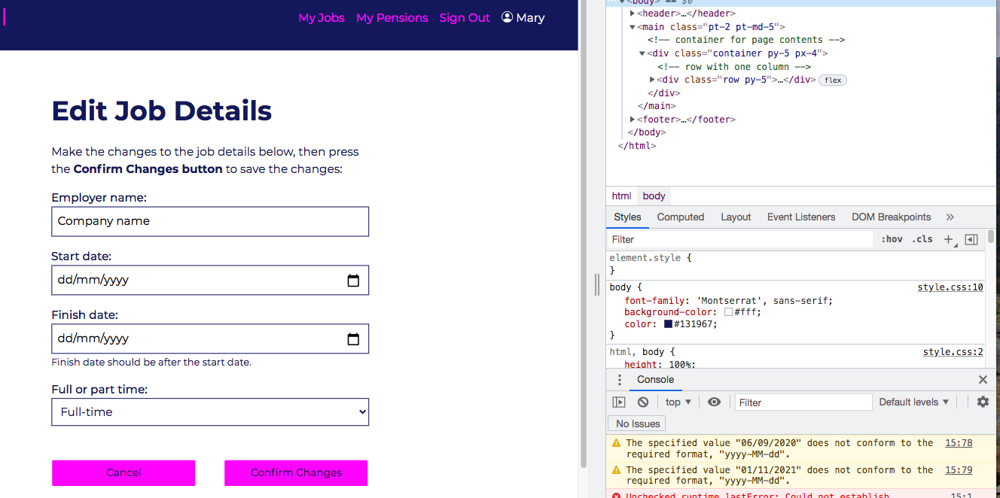
The error in the Console stated: `the specified value "06/09/2020" does not conform to the required format, "yyy-MM-dd"`
> Solution:
Amended the `widgets` setting in the `AddJobForm` in `forms.py`, for the `DateInput format` from `%d/%m/%Y` to `%Y-%m-%d` so that it matches the format expected, as [explained in this post on Stackoverflow](https://stackoverflow.com/questions/66504151/django-update-form-does-not-conform-to-the-required-format-yyyy-mm-dd). The front end still displays the desired format of dd/mm/yyyy (for Irish users) because the `LANGUAGE_CODE` had been set to `en_gb` in `settings.py`. 
- **Issue: `Add Pension Form` 'employment' field displaying all employments not just those belonging to that user**
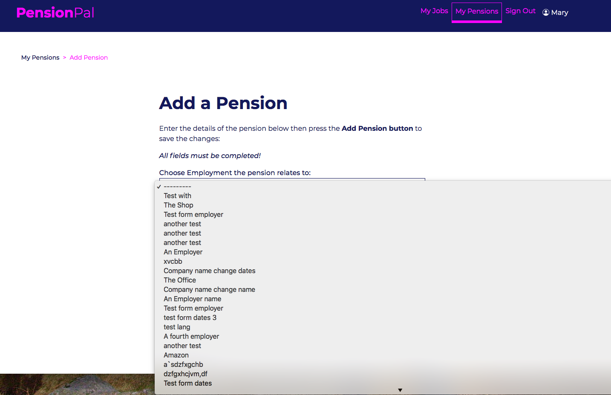
When the Add Pension form was displayed to the user, it is displaying all Employments from the Job table, but these need to be filtered to only show the records added to the Job table by that user. 
> Solution: Followed the advice in this [post on Stack Overflow](https://stackoverflow.com/questions/15608784/django-filter-the-queryset-of-modelchoicefield/15608899): Instead of amending the `forms.py`, added the below to the `AddPension` view in `views.py` so that the field contains just the `Job` records added by the current user. 
```python
form.fields['employment'].queryset = Job.objects.filter(added_by=request.user)
```
- **Issue: Testing the `AddPension View`, form would not post due to incorrect data in 'employment' and 'pension_provider' fields**
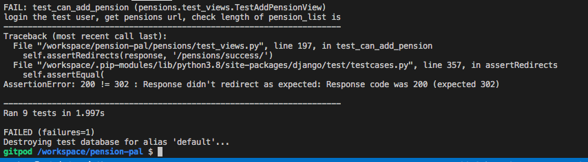
When testing the POST part of the `AddPension` View, the test was failing because the page was not redirecting as expected. This was because some of the form data was not valid, so the form was not posting and the page only redirects when the form is valid. 
> Solution: The issue was because of invalid data on the 'employment' and 'pension_provider' fields, which are foreign keys in the Pension model (from Job and Provider models respectively). When passing the data to post the test form, I had been passing in the relevant values from the test Job and Provider records, like the below:
```python
'employment': 'Test Company',
'pension_provider': 'A Pension Provider',
```
However, since these are foreign keys I needed to use their id instead of the actual values, as outlined in this [post on Stack Overflow](https://stackoverflow.com/questions/37393788/django-testing-a-form-is-valid-when-it-contains-a-modelchoicefield). Amended the data being passed to post the form to reference the id (which was 1 in both cases), like below, the tests then passed as the page redirected after posting the form:
```python
'employment': str(1),
'pension_provider': str(1),
```

- **Issue: File upload to Cloudinary from `PensionForm` not working**

Adding a file via the optional `file` field on the Add Pension or Edit Pension form did not give any errors and the form could be submitted, but the file did not appear when viewing the pension details on the frontend, nor did it appear in Cloudinary. When viewing the pension record in the Django admin panel, the file did not appear there either.
> Solution: On investigation with [Code Institute's](https://codeinstitute.net/ie/) tutor support, it transpired that the issue did not arise when adding a pension (with file upload) via the Django admin panel. However for this to work via the front end form, two parts were missing, as explained in the [Django docs](https://docs.djangoproject.com/en/4.0/topics/http/file-uploads/):
1. The `post` part of the `view` for posting the form needed to include `request.FILES` in the form constructor (see below), in order to record the file data:
```python
form = PensionForm(request.POST, request.FILES)
```
2. The `form` element in the relevant `html` files needed to include the `enctype` attribute with the value `"multipart/form-data"` as this is required where a file is uploaded through a form 

- **Issue: Using the delete pension or delete job url gives a 405 error instead of the custom 404 page**

Delete Pension url with valid pension id:
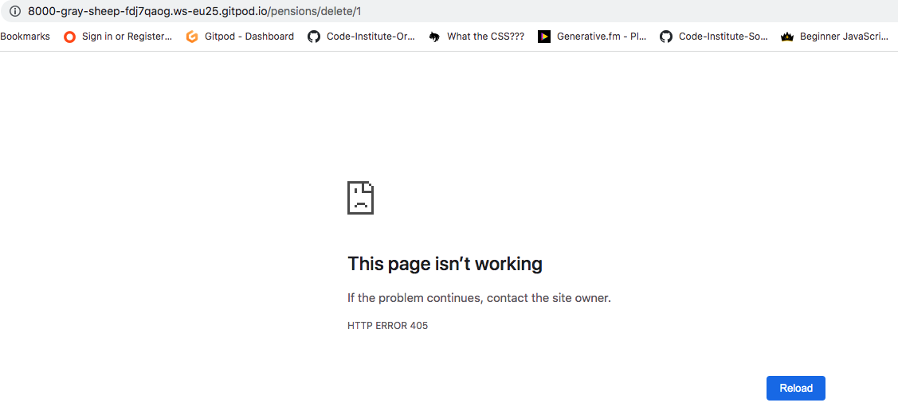
Delete Job url with valid job id:
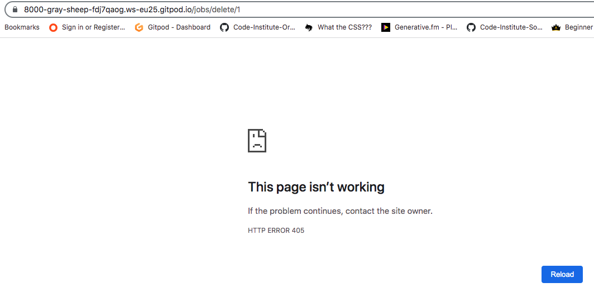
If a user tried to access the delete url (by typing the url into the browser) for a pension or job using a valid job or pension id that belongs to that user, a 405 error is raised instead of 404 (a 404 error would be raised if they used an invalid id in the url, and the custom 404 page would be displayed).
> Solution: The 405 http error [means method not allowed](https://httpstatuses.com/405), so it is being raised because there was no `get method` on the `DeleteJob` or `DeletePension` views (there was only a `post method` to delete the record, triggered by the Delete button in the modal). Updated both views to include a `get method`, which raises a 404 error so that the user will see the custom 404 page. There is no way to access the delete url from the website, but this update was done in case a user types the url into the browser, so that they are shown the custom 404 page instead of the generic 405 error page. 

- **Issue: Unique validation for `employer_name` giving Integrity Error**
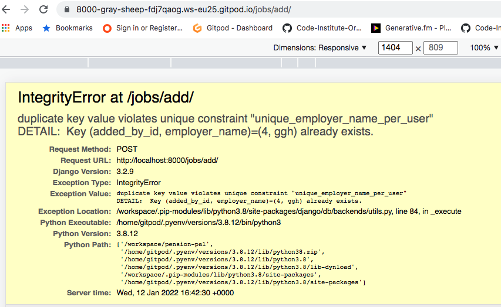
In the Job model, a unique constraint was added so that [users cannot add a job record with a duplicate employer name](https://github.com/Fiona-T/pension-pal/issues/42) - this is to avoid confusion when they add a pension record, as the pension record is linked to a job and that job details, so each job record must be unique for that user. During manual testing of this change, attempting to add a duplicate job record via the Add Job page raised an Integrity Error as shown above after the form was submitted.
> Solution: On reading [the Django Forms documentation](https://docs.djangoproject.com/en/3.1/ref/forms/validation/), the problem was that the `form.is_valid()` check called in the view was passing, but the `form.save()` method was failing because the model instance failed the unique constraint check. The reason for this is because the `'added_by'` field on the model (i.e the user) is excluded in the `AddJobForm` fields (because this is automatically set and doesn't need to be completed by the user on the form) and therefore the `is_valid()` method called on the form cannot do the unique validation because one of the fields in the unique constraint is not present on the form. The `.is_valid()` check on a `ModelForm` performs `.clean_fields()`, `.clean()` and `.validate_unique()` for all fields that are included in the form. In order to raise an error on a field that is not on the form, [the Django model instances validation documentation](https://docs.djangoproject.com/en/4.0/ref/models/instances/#validating-objects) recommends overriding the `Model.clean_fields()` method. Including the `.validate_unique()` method will then validate the unique constraints on the model (instead of just on individual fields). Therefore the Job model was updated to include the below method:
```python
def clean_fields(self, exclude=None):
        super().clean_fields(exclude=exclude)
        self.validate_unique()
``` 
- **Issue: Unique validation for `employer_name` and `added_by` giving Integrity Error**
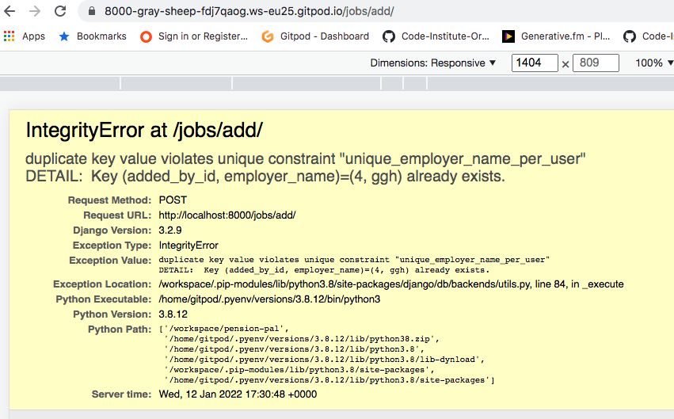
Following on from the above bug, even after adding the `clean_fields` method with `validate_unique`, an Integrity Error was still being raised.
> Solution: The `added_by` field was being set (`form.instance.added_by = request.user`) inside the `.is_valid()` method and was causing this issue. Moved this to be set before the `.is_valid` check is performed. 

- **Issue: AddJob form not displaying error messages or previously entered data**

After entering invalid data on the AddJob form, the record was correctly not added, but the form was returned to the user blank and without any error messages.
> Solution: The `else` part of the `if form.is_valid()` check was incorrectly creating a new instance of the AddJob form and including this with the context. Therefore a blank new form was being returned to the user. Updated the context to include the original form instance, as shown below:
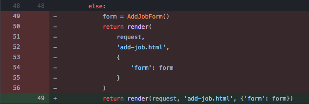


- **Issue: JobForm unique constraint error message is generic**
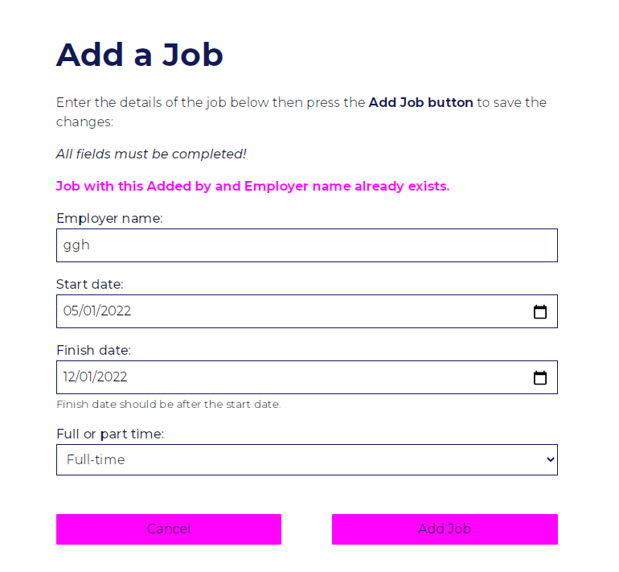
The error message displayed pulls in the name of the fields, but 'Added by' is not a field that the user would be familiar with, since this is set in the background based on the request user. A more helpful error message is needed.
> Solution: The error message is a `NON_FIELD_ERROR` set automatically by Django, however as advised in the [Django modelforms documentation](https://docs.djangoproject.com/en/4.0/topics/forms/modelforms/), the error message can be overridden in the form `Meta` class by adding the `NON_FIELD_ERRORS key` to the `error_messages dictionary` like below (and importing `NON_FIELD_ERRORS` from `django.core.exceptions` at the top of the `forms.py` file)
```python
error_messages = {
    NON_FIELD_ERRORS: {
        'unique_together': 'You already have a Job with this Employer'
        ' name. Choose a different name for this new Job record.'
    }
}
```

- **Issue: `jobs` app `test_views` failing after unique constraint added to `Job` model**
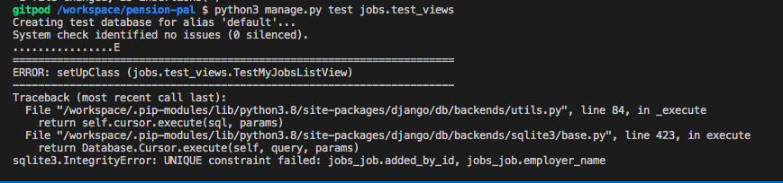
After the `UniqueConstraint` on `'employer_name'` per user was added to the `Job` model, the `test_views.py` file for jobs app was failing, on the `setUpClass` for the `TestMyJobsListView`
> Solution: The reason it was failing was because the `setUpClass` created 20 job records, 10 for each of 2 test users (in order to test pagination on listview), but it used the same details for each job record. Therefore these records were failing the unique check for employer name, as it would be creating 10 records with same employer name for each test user. 
Updated `'employer_name'` in `objects.create` to include the job index which we had from the below:
```python
number_of_jobs = 20
for job in range(number_of_jobs):
```
in the name, as shown below, so that each name will be different:
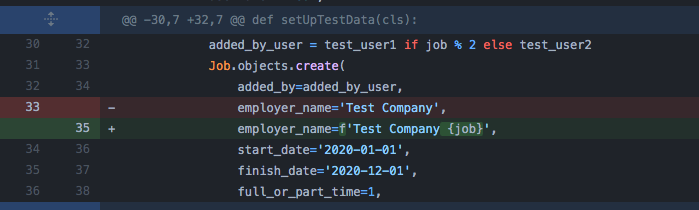

- **Issue: File name not retained for file upload on Pension form**
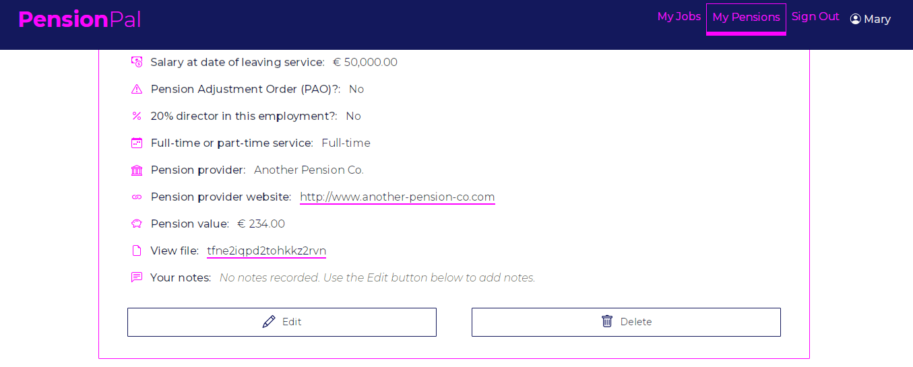
The name of the file uploaded by the user was not retained when saved in Cloudinary.
> Solution: The reason for this is [Cloudinary by default sets a random public ID for the uploaded file name](https://support.cloudinary.com/hc/en-us/articles/202520762-How-to-upload-images-while-keeping-their-original-filenames-), however this can be changed either by setting parameters on `CloudinaryFileField` in the form, or by setting an `Upload Preset` in the Cloudinary settings. Example of setting the parameters in the form (including the folder to upload the image to):
```python
file = CloudinaryFileField(
        options={
            'folder': 'media',
            'use_filename': 'true',
            'unique_filename': 'true',
        }
    )
```
I opted to use the `Upload Preset` instead of the above, setting `use_filename` to `true`, but kept the `unique_filename` parameter as `true`, so that files with the same name do not get overwritten (setting `unique_filename` to false means the filename stays as is, but then files with the same name would be overwritten). This means the file uploaded by the user retains their filename, but has randomly generated characters at the end of the filename, which is an acceptable solution to avoid any files being overwritten.

- **Issue: Error on file upload of type not accepted by Cloudinary image**
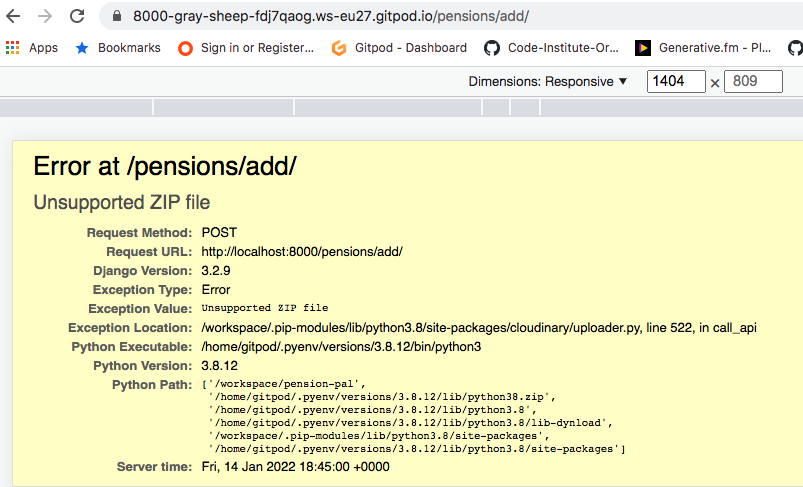
When trying to upload a file type of .doc, a Server Error (500) is generated (when `Debug=False`), see above for the error message when `Debug=True`. The error is arising because the `resource_type` for the Cloudinary file is by default `'image'` (which is fine for the purposes of this project), so a .doc file is not accepted. However an error message is not generating for the user, only the server error.
> Solution: On researching this, I could not find how to override the Cloudinary error checking, in order to present an error message on the form instead of having the Server Error. So I therefore added a `.clean()` method to this field in the form, to check for the extension on the file name, and raise a ValidationError that way - so that it is displayed on the form for the user:
```python
def clean_file(self):
    data = self.cleaned_data['file']
    if data:
        filename = data.name
        if not filename.endswith(('.jpg', '.png', '.jpeg')):
            raise ValidationError(
                'File type must be .png or .jpg. Choose a different file '
                'of the correct type'
                )
    return data
```

### Supported Screens and Browsers