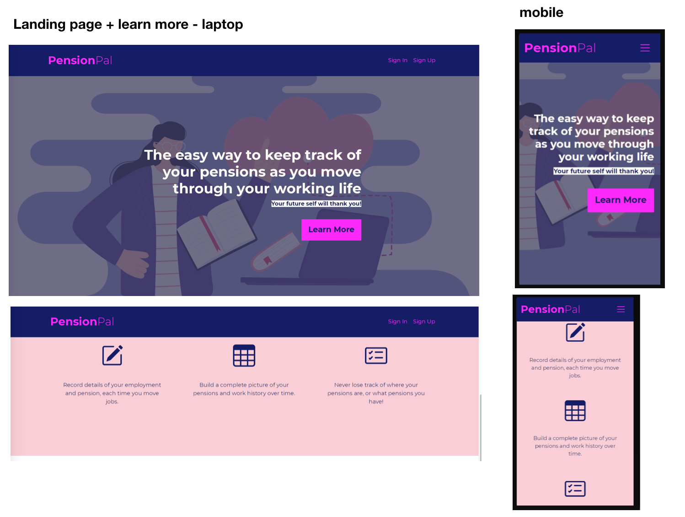

# PensionPal - Testing documentation
---
*This file contains the Testing section of the [full README.md file for PensionPal](README.md).*

## Table of Contents
---
- [Testing](#testing)
  * [Code Validation](#code-validation)
  * [Test Cases - user stories](#test-cases---user-stories)
  * [Features Testing](#features-testing)
  * [Other Manual Testing](#other-manual-testing)
  * [Automated Testing](#automated-testing)
  * [Fixed Bugs](#fixed-bugs)
  * [Supported Screens and Browsers](#supported-screens-and-browsers)

## Testing
---
### Code Validation
- The [W3C Markup Validation Service](https://validator.w3.org/) was used to validate the HTML on every page of the project. Two small errors were raised in relation to a missing `;` after the copyright entity, and a section without a `heading` element. These were rectified and all pages pass the validation check. The [results of checking each HTML page can be viewed here](docs/code-validation/html-validation.pdf).

- The [W3C CSS Validation Service](https://jigsaw.w3.org/css-validator/) was used to validate the project's custom CSS. [The CSS passes and the results can be viewed here](docs/code-validation/css-validation.png).

- [JSHint](https://jshint.com/) was used to check the quality of the JavaScript code and check for errors. Two `Missing semicolon` errors were rectified and there are no errors. [The results of this check can be viewed here](docs/code-validation/javascript-validation.png).

- The Python code has been validated using [PEP8 online checker](http://pep8online.com/). Errors in relation to `line too long (86 > 79 characters)` were fixed. There are no validation errors in the sumitted code for custom Python code. Django standard files have not been amended in relation to line length errors. The [results of validation each python file can be viewed here](docs/code-validation/python-validation.pdf).

### Test Cases - user stories
Note: testing of the user stories was carried out while each user story/feature was developed, to ensure acceptance criteria were met before the issue was closed. The below documents the user story testing that was completed at the end of the project.
- [#1](https://github.com/Fiona-T/pension-pal/issues/1): As a visiting user, I can learn what the site is about, so I can decide whether to sign up to the site
    * Acceptance Criteria 1:  The first thing a user should see on entering the website is an image relevant to the topic and a tagline explaining exactly what the website is for
    * Acceptance Criteria 2: There should be a Learn More button here, which will link to more detailed information
    * Acceptance Criteria 3: Below the image there should be a section briefly explaining the purpose of the website/the benefits for the user
  >**Result:** Pass, the above acceptance criteria are met, as shown below:


- [#19](https://github.com/Fiona-T/pension-pal/issues/19): As a visiting user I can find out what I could use the website for if I signed up so that I can understand the benefits of signing up and decide whether to sign up
    * Acceptance Criteria 1:  Home page has a section "What is PensionPal?" explaining briefly what the website will help the user achieve
    * Acceptance Criteria 2: Home page has a section "Why Use PensionPal?" explaining the benefits to the user
    * Acceptance Criteria 3: Home page has a section "How to Use PensionPal?" explaining to the user how to get started and how to use the site if they sign up for an account
  >**Result:** Pass, the above acceptance criteria are met as shown below:


- [#2](https://github.com/Fiona-T/pension-pal/issues/2): As a site user, I can navigate the site so that I can find the page I want to go to 
    *  Acceptance Criteria 1:  Header should be at the top of every page
    *  Acceptance Criteria 2: Logo (site name) should be prominent in the header and it links to the home page
    *  Acceptance Criteria 3:  Header contains just Sign Up, Sign In links in addition to the logo (since this is not a registered user)
  >**Result:** Pass, the above acceptance criteria are met, as seen on the screenprints for the previous user stories.

- [#18](https://github.com/Fiona-T/pension-pal/issues/18): As a registered user I can navigate the site so that I can find the page I want to go to
    * Acceptance Criteria 1:  If a user is not logged in, the header contains the logo (linked to home page) and the links to Sign In and Sign Up
    * Acceptance Criteria 2: If a user is logged in, the links in the header change: My Jobs, My Pensions, Sign Out are present and Sign Up and Sign In are no longer present.
    * Acceptance Criteria 3: Header is present on all pages as per above, and fixed to the top of the page
    * Acceptance Criteria 4: Username should be shown when user is logged in
  >**Result:** Pass, the above acceptance criteria are met as shown below (and for not signed in user, shown in previous user story).


- [#28](https://github.com/Fiona-T/pension-pal/issues/28): As a registered user I can see which page I am on within the My Jobs pages so that I can locate myself within the pages
    *  Acceptance Criteria 1:  When a user is on the pages that link from the main My Jobs page, there is a breadcrumb sub-navigation at the top of the page 
    *  Acceptance Criteria 2: For example, a user on the Add Job page will see a breadcrumb like: My Jobs -> Add Job, with My Jobs linking back to My Jobs page
    *  Acceptance Criteria 3: The main My Jobs page does not have a breadcrumb (since it is a top level page)
  >**Result:** Pass, the above acceptance criteria are met as shown below:


- [#29](https://github.com/Fiona-T/pension-pal/issues/29): As a user I can see which section of the website I am on so that I know which part of the website I went into
    * Acceptance Criteria 1:  The link, in the main navigation in the header, for the page the user is currently on, is styled differently when it is the active page (except for home page as the logo serves as the home page link)
    * Acceptance Criteria 2: For pages that have 'sub' pages e.g. My Jobs has add job, success page, etc., the different styling remains in the top navigation, when the user is within these sub pages
  >**Result:** Pass, the above acceptance criteria are met as shown below:


- [#52](https://github.com/Fiona-T/pension-pal/issues/52): As a registered I can see the title of the page I am on in the browser window so that I know which page I have open
    * Acceptance Criteria 1:  The relevant page title is displayed in the browser toolbar
    * Acceptance Criteria 2:  The title is specific to the page the user is currently on
  >**Result:** Pass, the above acceptance criteria are met as shown below:


- [#3](https://github.com/Fiona-T/pension-pal/issues/3): As a registered user, I can sign into my account so that I can access my jobs and pension information
    * Acceptance Criteria 1:  The page to sign in opens after clicking Sign In from the site header
    * Acceptance Criteria 2: The sign in page contains the username and password fields to sign in with, and sign in button
    * Acceptance Criteria 3: After signing in, the user is redirected to the My Jobs page
    * Acceptance Criteria 4: there is a note on the sign in page directing the user to the Sign Up page if they have not previously created an account
  >**Result:** Pass, the above acceptance criteria are met as shown below, and page redirects to My Jobs after sign in.


- [#4](https://github.com/Fiona-T/pension-pal/issues/4): As a registered user, I can sign out of my account when finished, so that I know I am signed out securely
    * Acceptance Criteria 1:  When a user is signed in, the Sign Out link is present in the header
    * Acceptance Criteria 2: After clicking the Sign Out link, the Sign Out page opens
    * Acceptance Criteria 3: Sign Out page has text asking user to confirm they want to sign out, and a button
    * Acceptance Criteria 4: after signing out, the user is redirected to the home page and the header reflects the status of a user who is not logged in, i.e. only contains the Sign In and Sign Up links and not My Jobs/My Pensions/Sign Out
  >**Result:** Pass, the above acceptance criteria are met as shown below:


- [#25](https://github.com/Fiona-T/pension-pal/issues/25): As a registered user I can cancel my sign out request so that I can easily get back to the page I was previously on 
    * Acceptance Criteria 1:  After clicking the Sign Out button, there is a button saying Cancel, as well as the Sign Out button
    * Acceptance Criteria 2: Clicking Cancel will bring the user back to the previous page they were on
  >**Result:** Pass, the above acceptance criteria are met, Cancel button on Sign Out form as shown above. And this brings the user back to the previous page.

- [#6](https://github.com/Fiona-T/pension-pal/issues/6): As a new user, I can sign up for an account so that I can start recording my jobs and pensions details
    * Acceptance Criteria 1:  The sign up page opens after clicking the Sign Up link in the header
    * Acceptance Criteria 2: Sign up page contains contains fields for the user to register with a username, email address and password and a button to submit the form
    * Acceptance Criteria 3: After submitting the form the user is brought to the My Jobs page (as they are now signed in)
    * Acceptance Criteria 4: The user can't submit the form unless all the fields have been completed
  >**Result:** Pass, the above acceptance criteria are met as shown below, and page redirects to My Jobs after sign up:


- [#7](https://github.com/Fiona-T/pension-pal/issues/7): As a registered user, I can record details of a job so that I can build up my employment history records
  * Acceptance Criteria 1:  A registered user can go to the My Jobs page, click Add a Job and a form is displayed for them to complete
  * Acceptance Criteria 2: The form contains fields for Employer name, date of joining, date of leaving, and whether the employment was full or part time.
  * Acceptance Criteria 3: All fields on the form are mandatory
  * Acceptance Criteria 4: After adding the employment details, the user can see these details in the My Jobs page
  >**Result:** Pass, the above acceptance criteria are met as shown below:


- [#21](https://github.com/Fiona-T/pension-pal/issues/21) As a registered user I can see confirmation that my job details were added so that I know the form submitted correctly and there were no errors
  * Acceptance Criteria 1:  After a registered user submits the Add Job form successfully, they are redirected to a success page
  * Acceptance Criteria 2: Success page confirms the employment was added and reminds the user to now add a pension if there was a pension attached to the job
  * Acceptance Criteria 3: Success page has links to the My Jobs page where the user can view the jobs they added
  >**Result:** Pass, the above acceptance criteria are met as shown below:


- [#23](https://github.com/Fiona-T/pension-pal/issues/23): As a registered user I can add the dates to the Add Job form in the order of: day, month, year so that I know I am entering the correct date, since this is the date format used in Ireland
* Acceptance Criteria 1:  The date fields on the Add Job form accept the format in the order of d, m, y. 
* Acceptance Criteria 2: E.g. if a user enters a date of 01/05/2021, this means a date of 1st May 2021 and not 5th Jan 2021
  >**Result:** Pass, the above acceptance criteria are met as shown below:


- [#24](https://github.com/Fiona-T/pension-pal/issues/24): As a registered user I can easily enter the dates when adding a job so that I can complete the form intuitively and easily
  * Acceptance Criteria 1:  The Add Job form has placeholders/helptext in the Start date and Finish date inputs
  * Acceptance Criteria 2: The placeholder/helptext shows the format of the date to use 
  *  cceptance Criteria 3: If possible a date picker is also included on these inputs so that the user can select the date more easily
  >**Result:** Pass, the above acceptance criteria are met as shown below; and user can either use the date picker to enter a date, or type into the placeholder text. It is clear to the user the date format that is being used and easy to enter a date.


- [#42](https://github.com/Fiona-T/pension-pal/issues/42): As a registered user I can not add a new Employment with the same name as another Employment in my Jobs records so that I don't add duplicate records which would cause confusion
  * Acceptance Criteria 1:  A logged in user on the Add Job form, cannot add an Employer Name that matches the employer name of one of their existing Job records
  * Acceptance Criteria 2: If they try to do this, an error is displayed on the Add Job form explaining that the employer name already exists and to edit or delete the existing Job record, or add a different Employer name for the new record
  * Acceptance Criteria 3: The Add Job form cannot be submitted until the Employer name differs to any of that user's existing job records
  >**Result:** Pass, the above acceptance criteria are met as shown below:
 

- [#55](https://github.com/Fiona-T/pension-pal/issues/55): As a registered user I can see a relevant error message if I enter a job finish date that is before the start date so that I can correct the error before the job record is saved
  * Acceptance Criteria 1:  When adding or editing a job, if the user enters a finish date that is before the start date on the form, the job is not added
  * Acceptance Criteria 2: The form is displayed again to the user, with an error message stating what the issue is, along with the data they previously entered into the form
  * Acceptance Criteria 3: When the user corrects the error and submits the form, the job is added/edited successfully
  >**Result:** Pass, the above acceptance criteria are met as shown below:
 

- [#8](https://github.com/Fiona-T/pension-pal/issues/8): As a registered user, I can see all the jobs I have added so that I can get the overall picture of my work history
  * Acceptance Criteria 1:  When a user is logged in and on the My Jobs page, all jobs added by that user are listed here
  * Acceptance Criteria 2: The jobs added to date are shown in a section called Your Jobs
  * Acceptance Criteria 3: Each job has the Employer name (prominently), the start and end date, and whether it was full or part time
  >**Result:** Pass, the above acceptance criteria are met as shown below:
 

- [#22](https://github.com/Fiona-T/pension-pal/issues/22): As a registered user I can see confirmation that I have no jobs recorded so that I know I have not previously recorded any jobs and that is why there are no jobs displayed
  * Acceptance Criteria 1:  On the My Jobs page there is a note underneath Your Jobs heading confirming that the user does not have any jobs added, if that user has not previously added any jobs, or has added jobs but deleted them
  * Acceptance Criteria 2: If the user does have jobs in their records, then these are displayed and the note is not displayed
  >**Result:** Pass, the above acceptance criteria are met as shown below (and see above for when there are jobs added):
 

- [#27](https://github.com/Fiona-T/pension-pal/issues/27): As a registered user I can view my jobs listings in shorter pages so that I can click through each page instead of scrolling through a long list of my jobs
  * Acceptance Criteria 1:  On the My Jobs page, under Your Jobs, the max number of jobs displayed is 6
  * Acceptance Criteria 2: If there are more than 6 jobs, then there is a pagination feature at the bottom of the page which allows the user to go from one page to the next/previous
  * Acceptance Criteria 3: If it is the first page of jobs, then there is only a next arrow. If it is the last page of jobs then there is only a previous arrow
  >**Result:** Pass, the above acceptance criteria are met as shown below:
 

- [#60](https://github.com/Fiona-T/pension-pal/issues/60): As a registered user I can see the pensions that are attached to a job so that I know whether there are any pensions attached or not, and can access the pensions easily if there are
  * Acceptance Criteria 1:  In the My Jobs page, the card for each job has information on whether there is a pension or pensions attached to the job
  * Acceptance Criteria 2: If there is no pension attached then a note on that job card confirms this
  * Acceptance Criteria 3: If there is a pension or pensions attached, the name of the pension scheme is shown and this is linked to the details page for that pension
  >**Result:** Pass, the above acceptance criteria are met as shown below - no pension attached, one pension attached or multiple pensions attached. Attached pensions are linked to the view full details page for each pension.
 

- [#9](https://github.com/Fiona-T/pension-pal/issues/9): As a registered user, I can edit a job so that I can correct the previously recorded information
   * Acceptance Criteria 1:  User can click on the Edit button on the jobs list, and this brings up a form to edit the details
  * Acceptance Criteria 2: The existing details of the job are pre-populated on the form so user just needs to update the fields that are changing
  * Acceptance Criteria 3: The form contains the same fields as the Add Job form, along with a confirmation button to Confirm, or a cancel button to go back
  * Acceptance Criteria 4: After submitting the form, the user is redirected to the my jobs page
  * Acceptance Criteria 5: The job in the jobs list now shows the amended details
  >**Result:** Pass, the above acceptance criteria are met as shown below:
 

- [#30](https://github.com/Fiona-T/pension-pal/issues/30): As a registered user I can only access the edit page for jobs that were added by me so that I cannot access the jobs of a different user and I know my records can't be accessed by another user 
  * Acceptance Criteria 1:  A user who is logged in and tries to access an edit job form by using a url with an id of a job they did not create, cannot access the page
  * Acceptance Criteria 2: The user is redirected to a 404 page
  * Acceptance Criteria 3: The user can still access the edit job form for their own records, using either the Edit button from the My Jobs list, or using a url with the job id in it
  >**Result:** Pass, the above acceptance criteria are met as shown below:
 

- [#45](https://github.com/Fiona-T/pension-pal/issues/45): As a registered user I can see confirmation the edits to my job record were successful so that I know the changes I made have been saved
  * Acceptance Criteria 1:  A logged in user, after pressing the Confirm Changes button on the Edit Job form is returned to the My Jobs page if the form was submitted successfully (existing functionality). A message is then displayed on the My Jobs page confirming the Job record was successfully updated with the changes
  >**Result:** Pass, the above acceptance criteria are met as shown below:
  

- [#53](https://github.com/Fiona-T/pension-pal/issues/53): As a registered user I can click a link that brings me to the Edit Job page, from the View or Edit pages of the attached Pension so that I can go directly to the Edit page of the associated Job, instead of having to navigate to it 
  * Acceptance Criteria 1:  There is a link directly to the Edit Job page from the View Full Details page for a pension
  * Acceptance Criteria 2: There is a link directly to the Edit Job page from the Edit Pension page
  * Acceptance Criteria 3: The linked Edit Job page is to edit the job that the pension is attached to 
  >**Result:** Pass, the above acceptance criteria are met as shown below:
  

### Features Testing
### Other Manual Testing
### Automated Testing
- #### Python tests
    Automated testing was carried out on the Python code in each of the three apps. Tests were written as each feature or user story was developed in each iteration, in line with the Agile approach used for the project development. The created tests were ran and the feature was not closed until the tests passed. Tests were written for the models, views and forms.

    On completion of the project, all tests were ran again to ensure they still passed and the results of these are shown below. The tests that were written are contained in the relevant `test_forms.py`, `test_views.py` and `test_models.py` files in each app.

    - Pages app automated test results - no models or forms, so only view tests
    

    - Jobs app automated test results - forms, models, views
    

    - Pensions app automated test results - forms, models, views
    

- #### Coverage
    The [coverage](https://coverage.readthedocs.io/en/6.2/) tool was used to determine the effectiveness of the tests. On the initial run, the pensions app was missing some tests and tests were added for the Add Pension and Edit Pension forms when the form is not valid, to ensure it reloads the page with the form. 

    As shown below, the final coverage report shows the pages and jobs apps both have 100% coverage, and the pensions app has 99% coverage. 

    - Pages app coverage report
    

    - Jobs app coverage report
    

    - Pensions app coverage report
    
    There is one test missing for forms.py in the pensions app as shown below, however this has been tested manually and since the overall level of coverage is very close to 100% it felt reasonable to leave the tests as is.
    

    To run the coverage report to see any further details, do the following in the IDE command line:
    1. install coverage: `pip3 install coverage`
    2. run coverage on specific app: `coverage run --source=appname manage.py test` e.g. for the jobs app it would be `coverage run --source=jobs manage.py test`
    4. generate the report (displays report in command line): `coverage report`
    5. generate an interactive html version of the report that can be viewed in the browser: `coverage html`
    6. view the report: `python3 -m http.server`. Open the port 8000 when it pops up, click on `htmlcov/` lin the Directory listing and then click on the specific module to see further details.

- #### JavaScript tests
    Since there is only a small amount of JavaScript code used in the project, the testing carried out for these functions was manual testing only, as part of the User Stories and Features testing described above.

### Fixed Bugs
The following bugs were encountered during development and during testing.

- **Issue: Edit Job Form not showing the existing data on the form for start date and finish date**

The error in the Console stated: `the specified value "06/09/2020" does not conform to the required format, "yyy-MM-dd"`
> Solution:
Amended the `widgets` setting in the `AddJobForm` in `forms.py`, for the `DateInput format` from `%d/%m/%Y` to `%Y-%m-%d` so that it matches the format expected, as [explained in this post on Stackoverflow](https://stackoverflow.com/questions/66504151/django-update-form-does-not-conform-to-the-required-format-yyyy-mm-dd). The front end still displays the desired format of dd/mm/yyyy (for Irish users) because the `LANGUAGE_CODE` had been set to `en_gb` in `settings.py`. 
- **Issue: `Add Pension Form` 'employment' field displaying all employments not just those belonging to that user**

When the Add Pension form was displayed to the user, it is displaying all Employments from the Job table, but these need to be filtered to only show the records added to the Job table by that user. 
> Solution: Followed the advice in this [post on Stack Overflow](https://stackoverflow.com/questions/15608784/django-filter-the-queryset-of-modelchoicefield/15608899): Instead of amending the `forms.py`, added the below to the `AddPension` view in `views.py` so that the field contains just the `Job` records added by the current user. 
```python
form.fields['employment'].queryset = Job.objects.filter(added_by=request.user)
```
- **Issue: Testing the `AddPension View`, form would not post due to incorrect data in 'employment' and 'pension_provider' fields**

When testing the POST part of the `AddPension` View, the test was failing because the page was not redirecting as expected. This was because some of the form data was not valid, so the form was not posting and the page only redirects when the form is valid. 
> Solution: The issue was because of invalid data on the 'employment' and 'pension_provider' fields, which are foreign keys in the Pension model (from Job and Provider models respectively). When passing the data to post the test form, I had been passing in the relevant values from the test Job and Provider records, like the below:
```python
'employment': 'Test Company',
'pension_provider': 'A Pension Provider',
```
However, since these are foreign keys I needed to use their id instead of the actual values, as outlined in this [post on Stack Overflow](https://stackoverflow.com/questions/37393788/django-testing-a-form-is-valid-when-it-contains-a-modelchoicefield). Amended the data being passed to post the form to reference the id (which was 1 in both cases), like below, the tests then passed as the page redirected after posting the form:
```python
'employment': str(1),
'pension_provider': str(1),
```

- **Issue: File upload to Cloudinary from `PensionForm` not working**

Adding a file via the optional `file` field on the Add Pension or Edit Pension form did not give any errors and the form could be submitted, but the file did not appear when viewing the pension details on the frontend, nor did it appear in Cloudinary. When viewing the pension record in the Django admin panel, the file did not appear there either.
> Solution: On investigation with [Code Institute's](https://codeinstitute.net/ie/) tutor support, it transpired that the issue did not arise when adding a pension (with file upload) via the Django admin panel. However for this to work via the front end form, two parts were missing, as explained in the [Django docs](https://docs.djangoproject.com/en/4.0/topics/http/file-uploads/):
1. The `post` part of the `view` for posting the form needed to include `request.FILES` in the form constructor (see below), in order to record the file data:
```python
form = PensionForm(request.POST, request.FILES)
```
2. The `form` element in the relevant `html` files needed to include the `enctype` attribute with the value `"multipart/form-data"` as this is required where a file is uploaded through a form 

- **Issue: Using the delete pension or delete job url gives a 405 error instead of the custom 404 page**

Delete Pension url with valid pension id:

Delete Job url with valid job id:

If a user tried to access the delete url (by typing the url into the browser) for a pension or job using a valid job or pension id that belongs to that user, a 405 error is raised instead of 404 (a 404 error would be raised if they used an invalid id in the url, and the custom 404 page would be displayed).
> Solution: The 405 http error [means method not allowed](https://httpstatuses.com/405), so it is being raised because there was no `get method` on the `DeleteJob` or `DeletePension` views (there was only a `post method` to delete the record, triggered by the Delete button in the modal). Updated both views to include a `get method`, which raises a 404 error so that the user will see the custom 404 page. There is no way to access the delete url from the website, but this update was done in case a user types the url into the browser, so that they are shown the custom 404 page instead of the generic 405 error page. 

- **Issue: Unique validation for `employer_name` giving Integrity Error**

In the Job model, a unique constraint was added so that [users cannot add a job record with a duplicate employer name](https://github.com/Fiona-T/pension-pal/issues/42) - this is to avoid confusion when they add a pension record, as the pension record is linked to a job and that job details, so each job record must be unique for that user. During manual testing of this change, attempting to add a duplicate job record via the Add Job page raised an Integrity Error as shown above after the form was submitted.
> Solution: On reading [the Django Forms documentation](https://docs.djangoproject.com/en/3.1/ref/forms/validation/), the problem was that the `form.is_valid()` check called in the view was passing, but the `form.save()` method was failing because the model instance failed the unique constraint check. The reason for this is because the `'added_by'` field on the model (i.e the user) is excluded in the `AddJobForm` fields (because this is automatically set and doesn't need to be completed by the user on the form) and therefore the `is_valid()` method called on the form cannot do the unique validation because one of the fields in the unique constraint is not present on the form. The `.is_valid()` check on a `ModelForm` performs `.clean_fields()`, `.clean()` and `.validate_unique()` for all fields that are included in the form. In order to raise an error on a field that is not on the form, [the Django model instances validation documentation](https://docs.djangoproject.com/en/4.0/ref/models/instances/#validating-objects) recommends overriding the `Model.clean_fields()` method. Including the `.validate_unique()` method will then validate the unique constraints on the model (instead of just on individual fields). Therefore the Job model was updated to include the below method:
```python
def clean_fields(self, exclude=None):
        super().clean_fields(exclude=exclude)
        self.validate_unique()
``` 
- **Issue: Unique validation for `employer_name` and `added_by` giving Integrity Error**

Following on from the above bug, even after adding the `clean_fields` method with `validate_unique`, an Integrity Error was still being raised.
> Solution: The `added_by` field was being set (`form.instance.added_by = request.user`) inside the `.is_valid()` method and was causing this issue. Moved this to be set before the `.is_valid` check is performed. 

- **Issue: AddJob form not displaying error messages or previously entered data**

After entering invalid data on the AddJob form, the record was correctly not added, but the form was returned to the user blank and without any error messages.
> Solution: The `else` part of the `if form.is_valid()` check was incorrectly creating a new instance of the AddJob form and including this with the context. Therefore a blank new form was being returned to the user. Updated the context to include the original form instance, as shown below:


- **Issue: JobForm unique constraint error message is generic**

The error message displayed pulls in the name of the fields, but 'Added by' is not a field that the user would be familiar with, since this is set in the background based on the request user. A more helpful error message is needed.
> Solution: The error message is a `NON_FIELD_ERROR` set automatically by Django, however as advised in the [Django modelforms documentation](https://docs.djangoproject.com/en/4.0/topics/forms/modelforms/), the error message can be overridden in the form `Meta` class by adding the `NON_FIELD_ERRORS key` to the `error_messages dictionary` like below (and importing `NON_FIELD_ERRORS` from `django.core.exceptions` at the top of the `forms.py` file)
```python
error_messages = {
    NON_FIELD_ERRORS: {
        'unique_together': 'You already have a Job with this Employer'
        ' name. Choose a different name for this new Job record.'
    }
}
```

- **Issue: `jobs` app `test_views` failing after unique constraint added to `Job` model**

After the `UniqueConstraint` on `'employer_name'` per user was added to the `Job` model, the `test_views.py` file for jobs app was failing, on the `setUpClass` for the `TestMyJobsListView`
> Solution: The reason it was failing was because the `setUpClass` created 20 job records, 10 for each of 2 test users (in order to test pagination on listview), but it used the same details for each job record. Therefore these records were failing the unique check for employer name, as it would be creating 10 records with same employer name for each test user. 
Updated `'employer_name'` in `objects.create` to include the job index which we had from the below:
```python
number_of_jobs = 20
for job in range(number_of_jobs):
```
in the name, as shown below, so that each name will be different:


- **Issue: File name not retained for file upload on Pension form**

The name of the file uploaded by the user was not retained when saved in Cloudinary.
> Solution: The reason for this is [Cloudinary by default sets a random public ID for the uploaded file name](https://support.cloudinary.com/hc/en-us/articles/202520762-How-to-upload-images-while-keeping-their-original-filenames-), however this can be changed either by setting parameters on `CloudinaryFileField` in the form, or by setting an `Upload Preset` in the Cloudinary settings. Example of setting the parameters in the form (including the folder to upload the image to):
```python
file = CloudinaryFileField(
        options={
            'folder': 'media',
            'use_filename': 'true',
            'unique_filename': 'true',
        }
    )
```
I opted to use the `Upload Preset` instead of the above, setting `use_filename` to `true`, but kept the `unique_filename` parameter as `true`, so that files with the same name do not get overwritten (setting `unique_filename` to false means the filename stays as is, but then files with the same name would be overwritten). This means the file uploaded by the user retains their filename, but has randomly generated characters at the end of the filename, which is an acceptable solution to avoid any files being overwritten.

- **Issue: Error on file upload of type not accepted by Cloudinary image**

When trying to upload a file type of .doc, a Server Error (500) is generated (when `Debug=False`), see above for the error message when `Debug=True`. The error is arising because the `resource_type` for the Cloudinary file is by default `'image'` (which is fine for the purposes of this project), so a .doc file is not accepted. However an error message is not generating for the user, only the server error.
> Solution: On researching this, I could not find how to override the Cloudinary error checking, in order to present an error message on the form instead of having the Server Error. So I therefore added a `.clean()` method to this field in the form, to check for the extension on the file name, and raise a ValidationError that way - so that it is displayed on the form for the user:
```python
def clean_file(self):
    data = self.cleaned_data['file']
    if data:
        filename = data.name
        if not filename.endswith(('.jpg', '.png', '.jpeg')):
            raise ValidationError(
                'File type must be .png or .jpg. Choose a different file '
                'of the correct type'
                )
    return data
```
- **Issue: HTML form validation on Add Pension or Edit Pension not showing the error messages for fields with `required` attribute**

When submitting the form without the `required` fields completed, the form correctly didn't submit, but it did not display the usual error message "Please select an item in the list" or "Please fill in this field" for the first non-completed required field. The issue happens when the first uncompleted `required` field is outside of the viewport when the submit button is pressed. It doesn't happen when the first uncompleted `required` field is visible in the viewport when the form is submitted.
> Solution: The issue appears to be a bug on Chrome, as explained on [this post on Stack Overflow](https://stackoverflow.com/questions/69015407/html5-form-validation-message-doesnt-show-when-scroll-behaviour-is-set-to-smoo), caused by a combination of having `scroll-behavior: smooth` style set on the `html` element or `:root` pseudo selector, and the form being longer than the viewport window. (This is [also mentioned as a bug for Bootstrap 5](https://github.com/twbs/bootstrap/issues/33757) since `scroll-behavior:smooth` is set on `:root` in Bootstrap 5) Since the `scroll-behavior: smooth` is only affecting the PensionForm and is fine on the other pages, I created a short JavaScript function to change the `scroll-behavior` to `auto` for the Add Pension and Edit Pension pages:
```javascript
function changeScrollToAuto() {
    if(document.title === "Add Pension" || document.title === "Edit Pension") {
        document.documentElement.style.setProperty('scroll-behavior', 'auto')
    }
}
```
The HTML form validation error messages now display for non-completed `required` fields, however the scroll to the required field is not seamless. However the built in HTML validation and error messages is sufficient at this point in the project development. Later iterations of the project could include some client side validation of the form using JavaScript, to include a scroll to the field with the error, and/or to provide additonal error messages for the user.

- **Issue: Attribute Error on Edit Pension form file field if the data in the file field is not changed**

The above error is raised when submitting the PensionForm on the EditPension view, when there is an existing file in the file field and it is not being changed, i.e. not clearing the existing file and not adding a new file.
> Solution: The error is happening in the `clean_file()` method on the `PensionForm`, because it is checking for the `name` of the file (to check if it doesn't end in .jpg or .png). However because the data in the field is not a new file but is an existing `CloudinaryResource object`, there is no `name` attribute. Added the check on the file name to a `try` block, and added an `except` block that passes on the `AttributeError` as this should only be raised if the file field contains an existing file i.e. a `CloudinaryResource object`. Since this file has already been checked when the file was initially added, and already exists on Cloudinary (the check is in place because Cloudinary gives a server error if the user tries to add a file like pdf, word document etc., so to give the user a proper error message) then in this case it seems reasonable to pass on the `AttributeError`.

- **Issue: Error when searching a foreign key in Django admin site**

The Django admin site gave the above error for the `Pension` model when trying to search the pensions records.
> Solution: This issue was caused by `'employment'` being included in the `search_fields` list. This is a `ForeignKey` field (linked to the `Job` model), so it needed to be referenced in the `search_fields` list using the name of the relevant field in the Job model, so in this case: `'employment__employer_name'`. I found the answer to this issue in [this Stack Overflow post](https://stackoverflow.com/questions/11754877/troubleshooting-related-field-has-invalid-lookup-icontains).

### Supported Screens and Browsers